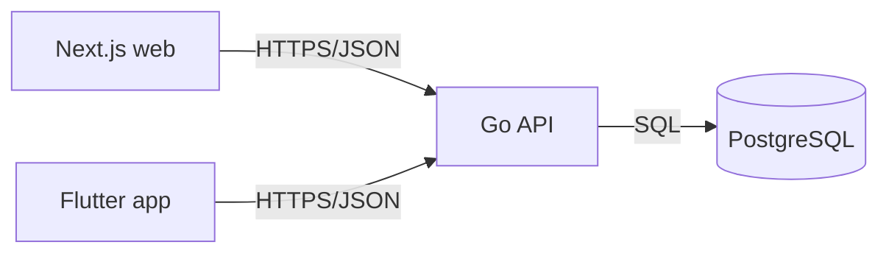

# Architecture

_Status: **stub** — filled after PRD is agreed._

## Components in scope
- [ ] `/backend` — Go service (Gin + GORM, Clean Architecture)
- [ ] `/web` — Next.js App Router
- [ ] `/mobile` — Flutter

## Component diagram

## Deployment target
-

## Major third-party dependencies
-

## Cross-cutting concerns
- Auth:
- Observability:
- Config & secrets:

## Open questions
-
