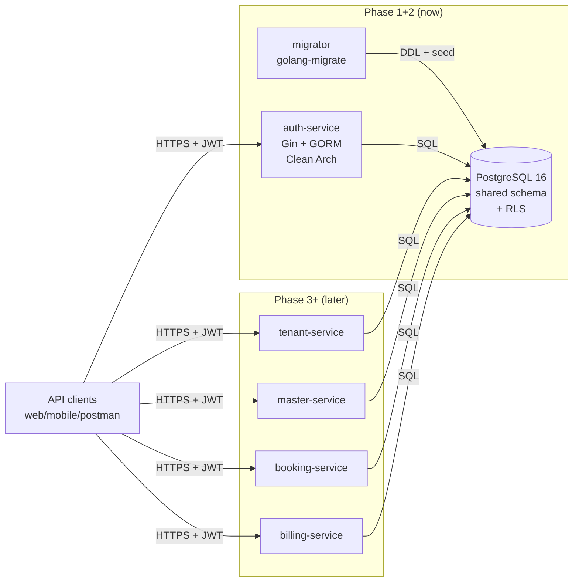
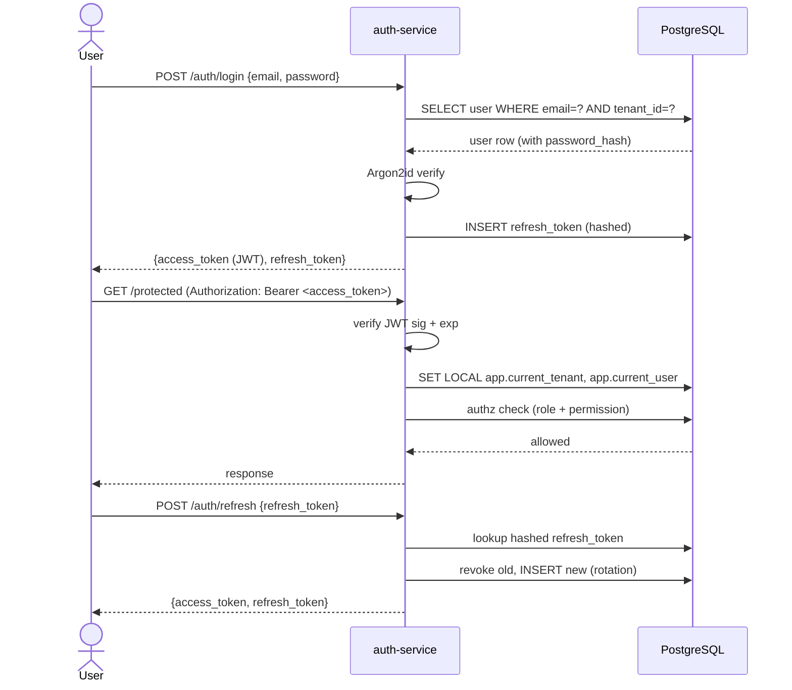

# Architecture — Lustia

> Scope: Phase 1 + 2. Later phases will extend this file.

## Components in scope (Phase 1+2)

- [x] **Database** — PostgreSQL 16+, shared schema, multi-tenant via `tenant_id` + RLS
- [x] **Migrations** — standalone folder `/lustia/migrations/`, `golang-migrate`-compatible
- [x] **`auth-service`** — Go microservice (Gin + GORM, Clean Architecture + SOLID)
- [ ] `tenant-service` — Phase 3
- [ ] `master-service` (therapist / service / schedule) — Phase 4
- [ ] `booking-service` — Phase 5
- [ ] `billing-service` — Phase 6
- [ ] Web / mobile clients — later

## Component diagram



## Service layout (per-microservice layered architecture)

Every service under `/lustia/services/<name>/` follows the same layout:

```
services/<name>/
├── cmd/<name>/main.go          # composition root — all wiring here
├── internal/
│   ├── constants/              # string constants, error codes, enum mirrors
│   ├── controller/             # HTTP handlers + request/response DTOs
│   ├── helper/                 # pure utility functions (hashing, JWT, response builders)
│   ├── middleware/             # HTTP middleware (JWT, RBAC, tenant, rate limit, recover, request ID)
│   ├── model/                  # GORM models + structs shared across layers
│   ├── repository/             # DB access via GORM
│   ├── route/                  # route registration onto *gin.Engine
│   └── service/                # business logic
├── config/
│   ├── app.yaml                # non-secret defaults
│   └── app.local.yaml          # local overrides (gitignored)
├── Dockerfile
├── go.mod
└── go.sum
```

Rules (from `go-expert` agent):
- **Request flow:** `route → middleware → controller → service → repository → DB`.
- Controllers never call repositories directly — they call services. Services are the only callers of repositories.
- Services never import `gin` or `net/http`. Repositories never import `gin`.
- Service-layer interfaces (e.g., `UserRepository`) are declared **in the service package** (consumer-owned). Concrete repos satisfy them implicitly.
- All wiring happens in `cmd/<name>/main.go` — no package-level globals, no `init()` DI.
- SOLID still applies: SRP per file, small consumer-owned interfaces, DI via constructors.

## Multi-tenancy strategy

**Shared schema + `tenant_id` column on every operational table + PostgreSQL Row-Level Security.**

- Every operational table has `tenant_id UUID NOT NULL REFERENCES tenant(id)` and an index on it.
- Tables with branch-level data additionally have `branch_id UUID NOT NULL REFERENCES branch(id)`.
- RLS policies on each operational table:
  ```sql
  CREATE POLICY tenant_isolation ON <table>
    USING (tenant_id::text = current_setting('app.current_tenant', true));
  ```
- At the start of every request transaction, the auth middleware calls:
  ```sql
  SET LOCAL app.current_tenant = '<tenant_uuid>';
  SET LOCAL app.current_user   = '<user_uuid>';
  ```
- Even if app code forgets a `WHERE tenant_id = ?`, the DB still refuses to return rows from other tenants. Defense in depth.

**Super admin bypass:** the `super_admin` role uses a separate DB role that has `BYPASSRLS`. App infrastructure sets the DB role per-request based on the authenticated user's role.

## Authentication flow (Phase 2)



## Deployment target (Phase 1+2)

- **Local dev:** `docker-compose.yml` in `/lustia/deploy/` runs: Postgres 16, `golang-migrate` one-shot migrator, auth-service.
- **Staging / prod:** deferred. Dockerfile for auth-service will be deployable to any container runtime (k8s, ECS, Cloud Run, Fly.io) when that decision comes.

## Major third-party dependencies

- `github.com/chrisanlung/common-configs` — shared config/log/DB/transport (our library).
- `github.com/gin-gonic/gin` — HTTP framework.
- `gorm.io/gorm` + `gorm.io/driver/postgres` — ORM.
- `github.com/golang-jwt/jwt/v5` — JWT issue + verify.
- `github.com/alexedwards/argon2id` — password hashing.
- `github.com/google/uuid` — UUID generation (UUIDv7 where supported).
- `github.com/go-playground/validator/v10` — request validation (via Gin binding).
- `golang-migrate/migrate` (as CLI / Docker image) — migrations.

## Cross-cutting concerns

- **Auth:** JWT (RS256 by default) signed by auth-service's private key; public key distributed via JWKS endpoint for other services to verify locally.
- **Observability:** OpenTelemetry traces + structured logs from `common-configs`. Every request carries `trace_id` and `request_id`.
- **Config:** YAML + env var expansion from `common-configs`. Secrets **never** in repo; injected via env.
- **Secrets for Phase 1+2:** managed via `.env` file locally; production will use a secret manager later.

## Open questions

- Do later services share one Postgres instance or one DB per service? **Default: one Postgres, one schema, all services share tables — true multi-service with shared DB.** RLS keeps tenant isolation regardless. Revisit if a service becomes write-heavy enough to need its own DB.
- JWKS distribution vs hardcoded public key: **default JWKS endpoint at `/auth/.well-known/jwks.json`**; other services cache it with TTL. Confirm with security-expert.
