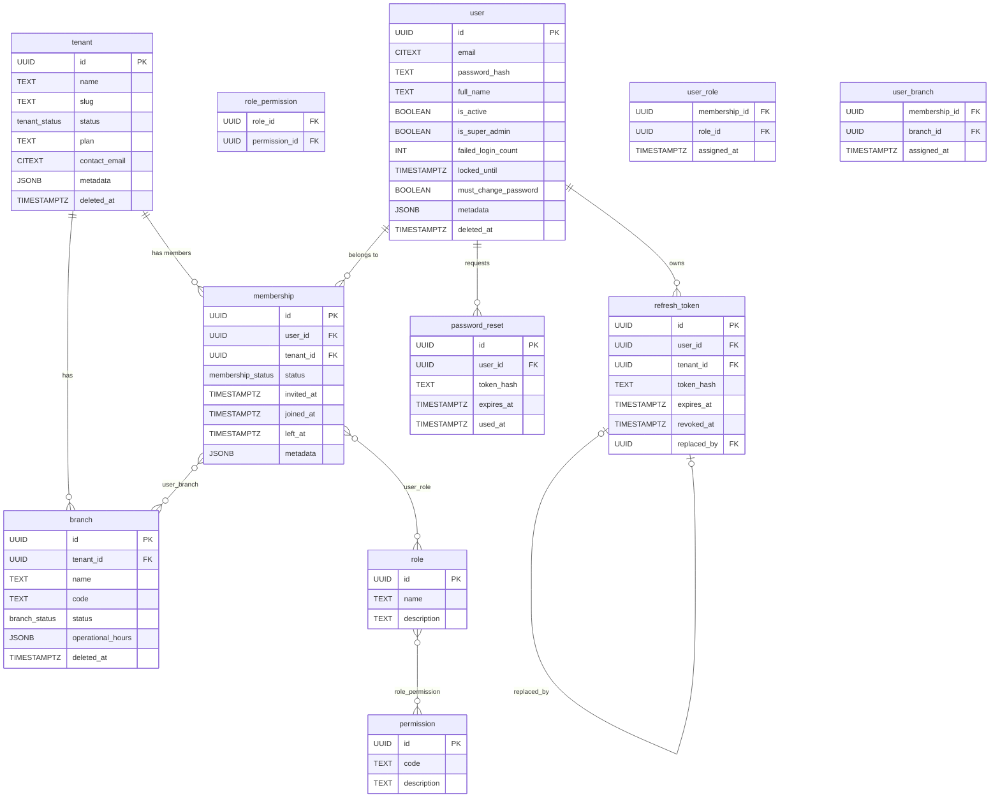
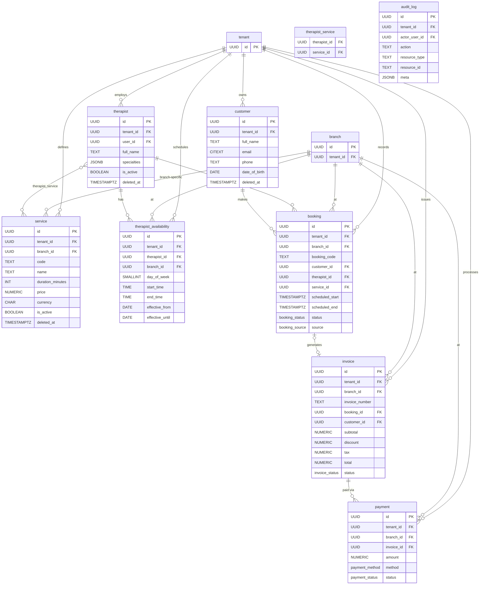
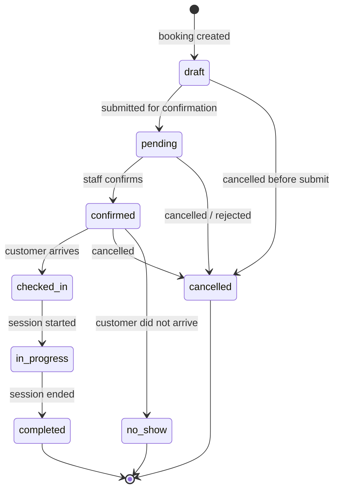
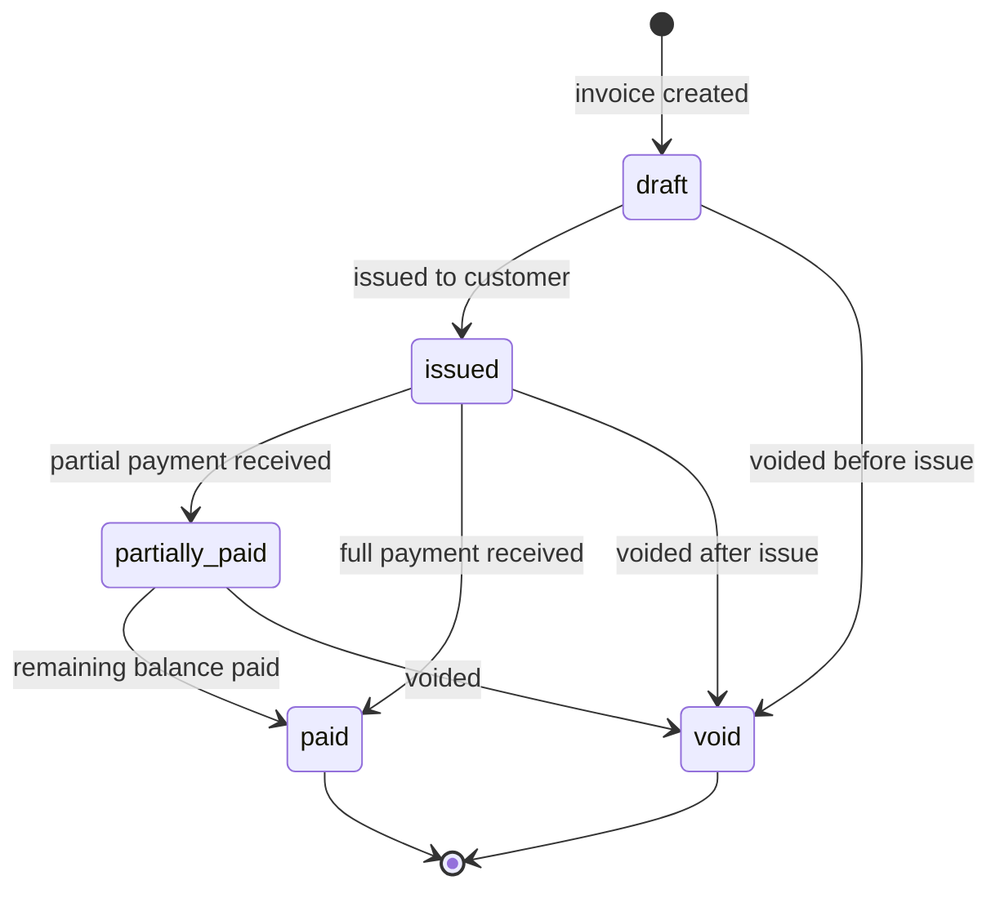
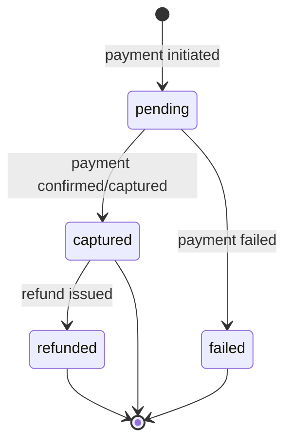

# Data Model — Lustia

_Owned by `db-designer`. Every schema change — new table, column, index, or constraint — must update this file in the same turn as the migration._

_Last updated: 2026-04-21 — ADR 0007 User–Membership Pattern (migration 000009)_

---

## 1. Domain Summary

Lustia is a multi-tenant B2B platform for wellness and therapy businesses. The platform owner (a single "super admin" entity) onboards companies (tenants). Each tenant represents one company and may operate one or more physical or logical locations (branches). Within a branch, therapists deliver services to customers via bookings that generate invoices and payments.

The schema is divided into two logical groups. The **access-control group** covers the platform and tenant hierarchy: tenants, branches, the six roles (`super_admin`, `tenant_admin`, `branch_admin`, `finance`, `therapist`, `customer`), fine-grained permissions, users (internal staff, not customers), and authentication artifacts (refresh tokens, password-reset tokens). The **operational group** covers the therapy business: customer records, service catalog, therapist profiles, weekly availability windows, bookings, invoices, and payments. An append-only `audit_log` captures platform and tenant events for compliance.

All operational tables carry `tenant_id` and are isolated by PostgreSQL Row-Level Security (RLS). The DB connection used by the application (`lustia_app`) has RLS enforced; only the migration role (`lustia_migrator`, `BYPASSRLS`) can cross tenant boundaries at the DB level.

---

## 2. ERDs

### 2.1 Access Control Group

_Updated 2026-04-21: ADR 0007 — `user.tenant_id` removed; `membership` table added; `user_role`/`user_branch` re-keyed to `membership_id`._



### 2.2 Operational Group



---

## 3. Table Catalog

Standard audit columns on all tables (unless noted as append-only):

| Column | Type | Notes |
|---|---|---|
| `created_at` | `TIMESTAMPTZ NOT NULL DEFAULT now()` | Set on INSERT |
| `updated_at` | `TIMESTAMPTZ NOT NULL DEFAULT now()` | Auto-updated by `set_updated_at()` trigger |
| `created_by` | `UUID NULL REFERENCES "user"(id)` | Nullable: system/migration can create rows |
| `updated_by` | `UUID NULL REFERENCES "user"(id)` | Nullable |

Soft-delete tables additionally have `deleted_at TIMESTAMPTZ NULL`. Active-row partial indexes use `WHERE deleted_at IS NULL`.

---

### tenant

**Purpose:** One row per company registered on the platform.

| Column | Type | Constraints | Notes |
|---|---|---|---|
| `id` | `UUID` | PK, `DEFAULT gen_random_uuid()` | |
| `name` | `TEXT` | NOT NULL, length 1–200 | Company display name |
| `slug` | `TEXT` | NOT NULL, length 1–100; UNIQUE WHERE deleted_at IS NULL | URL-safe identifier |
| `status` | `tenant_status` | NOT NULL, DEFAULT `pending_approval` | Lifecycle status |
| `plan` | `TEXT` | NULL, length ≤ 50 | Subscription plan placeholder |
| `contact_name` | `TEXT` | NULL | Primary contact |
| `contact_email` | `CITEXT` | NULL, length ≤ 320 | |
| `contact_phone` | `TEXT` | NULL, length ≤ 30 | |
| `metadata` | `JSONB` | NOT NULL, DEFAULT `{}` | Extensible fields (logo_url, industry, etc.) |
| `deleted_at` | `TIMESTAMPTZ` | NULL | Soft delete |
| _audit columns_ | | | `created_at`, `updated_at`, `created_by`, `updated_by` |

**Indexes:** `tenant_slug_active_uidx` (partial unique), `tenant_status_idx`, `tenant_metadata_gin` (GIN).
**RLS:** None — platform-level table.

---

### branch

**Purpose:** A physical or logical location within a tenant.

| Column | Type | Constraints | Notes |
|---|---|---|---|
| `id` | `UUID` | PK | |
| `tenant_id` | `UUID` | NOT NULL, FK → `tenant(id)` RESTRICT | |
| `name` | `TEXT` | NOT NULL, length 1–200 | |
| `code` | `TEXT` | NULL, length ≤ 50; UNIQUE per tenant WHERE active | Optional short code |
| `status` | `branch_status` | NOT NULL, DEFAULT `active` | |
| `address_line1/2` | `TEXT` | NULL | |
| `city` / `province` / `postal_code` | `TEXT` | NULL | |
| `country_code` | `CHAR(2)` | NULL | ISO 3166-1 alpha-2 |
| `contact_phone` / `contact_email` | `TEXT` / `CITEXT` | NULL | |
| `operational_hours` | `JSONB` | NOT NULL, DEFAULT `[]` | Array of `{day, open, close}` |
| `metadata` | `JSONB` | NOT NULL, DEFAULT `{}` | |
| `deleted_at` | `TIMESTAMPTZ` | NULL | |
| _audit columns_ | | | |

**Indexes:** `branch_tenant_id_idx`, `branch_tenant_code_active_uidx` (partial unique), `branch_status_idx`, `branch_metadata_gin`.
**RLS:** `tenant_isolation` policy — reads/writes filtered by `app.current_tenant`.

---

### role

**Purpose:** Platform-wide role definitions. Seeded at migration 000005.

| Column | Type | Constraints | Notes |
|---|---|---|---|
| `id` | `UUID` | PK | Fixed UUIDs in seed |
| `name` | `TEXT` | NOT NULL, UNIQUE, length 1–100 | e.g. `super_admin` |
| `description` | `TEXT` | NULL | |
| _audit columns_ | | | |

**RLS:** None — platform-level table.

---

### permission

**Purpose:** Fine-grained permission codes. Seeded at migration 000005. 47 permissions across 13 resource groups.

| Column | Type | Constraints | Notes |
|---|---|---|---|
| `id` | `UUID` | PK | Fixed UUIDs in seed |
| `code` | `TEXT` | NOT NULL, UNIQUE, length 1–100 | e.g. `booking.create` |
| `description` | `TEXT` | NULL | |
| _audit columns_ | | | |

**RLS:** None — platform-level table.

---

### role_permission

**Purpose:** Junction between role and permission. Seeded at migration 000005.

| Column | Type | Constraints | Notes |
|---|---|---|---|
| `role_id` | `UUID` | PK part, FK → `role(id)` CASCADE | |
| `permission_id` | `UUID` | PK part, FK → `permission(id)` CASCADE | |
| `created_at` | `TIMESTAMPTZ` | NOT NULL DEFAULT now() | |
| `created_by` | `UUID` | NULL | |

**Indexes:** `role_permission_permission_id_idx`.
**RLS:** None — platform-level table.

---

### "user"

**Purpose:** Human identity — one row per login identity, independent of tenant. Internal platform users (super admins and all tenant staff). Customers are in the separate `customer` table.

_Updated 2026-04-21: ADR 0007 — `tenant_id` column removed; `is_super_admin` column added; uniqueness model changed to global email. See `membership` table for user–tenant relationships._

| Column | Type | Constraints | Notes |
|---|---|---|---|
| `id` | `UUID` | PK | |
| `email` | `CITEXT` | NOT NULL, length 3–320 | Case-insensitive; globally unique |
| `password_hash` | `TEXT` | NOT NULL | Argon2id encoded string |
| `full_name` | `TEXT` | NOT NULL, length 1–200 | |
| `phone` | `TEXT` | NULL, length ≤ 30 | |
| `avatar_url` | `TEXT` | NULL, length ≤ 2048 | Object-storage URL |
| `is_active` | `BOOLEAN` | NOT NULL, DEFAULT true | |
| `is_super_admin` | `BOOLEAN` | NOT NULL, DEFAULT false | When true: JWT scope=platform, roles=[super_admin] synthesised from flag (no user_role rows needed). Added migration 000009. |
| `last_login_at` | `TIMESTAMPTZ` | NULL | |
| `failed_login_count` | `INT` | NOT NULL, DEFAULT 0 | Brute-force counter |
| `locked_until` | `TIMESTAMPTZ` | NULL | Lockout expiry |
| `must_change_password` | `BOOLEAN` | NOT NULL, DEFAULT false | Added migration 000006. When true, auth-service blocks protected requests until the password is rotated. Set on admin-created and seeded users. |
| `metadata` | `JSONB` | NOT NULL, DEFAULT `{}` | |
| `deleted_at` | `TIMESTAMPTZ` | NULL | Soft delete |
| _audit columns_ | | | |

**Uniqueness:**
- `user_email_uidx`: UNIQUE `(email)` WHERE `deleted_at IS NULL` — one active login identity per email address, globally. Replaces the previous `(tenant_id, email)` + global-null dual-index model.

**Indexes:** `user_is_active_idx`, `user_locked_until_idx`, `user_metadata_gin`.
**RLS:** Three policies (`user_visible`, `user_write`, `user_update`). Visibility: platform scope (`__platform__`) or shared active membership tenant or self (`app.current_user`). Insert restricted to platform scope. Update: platform scope, self, or shared active membership tenant. See §6 for detail.

---

### membership

**Purpose:** Workspace-membership record linking one user identity to one tenant. One row = one human working for (or invited to) one company. Added in migration 000009 (ADR 0007).

| Column | Type | Constraints | Notes |
|---|---|---|---|
| `id` | `UUID` | PK, DEFAULT gen_random_uuid() | |
| `user_id` | `UUID` | NOT NULL, FK → `"user"(id)` CASCADE | |
| `tenant_id` | `UUID` | NOT NULL, FK → `tenant(id)` CASCADE | |
| `status` | `membership_status` | NOT NULL, DEFAULT `active` | Enum: `active`, `suspended`, `invited`, `left` |
| `invited_at` | `TIMESTAMPTZ` | NULL | Set when an invite is issued |
| `joined_at` | `TIMESTAMPTZ` | NOT NULL, DEFAULT now() | When the user accepted / was created |
| `left_at` | `TIMESTAMPTZ` | NULL | Set when status transitions to `left` |
| `metadata` | `JSONB` | NOT NULL, DEFAULT `{}` | |
| `deleted_at` | | (none) | No soft delete; status field carries lifecycle |
| _audit columns_ | | | |

**Uniqueness:** `uq_membership_user_tenant`: UNIQUE `(user_id, tenant_id)` — one membership row per user-tenant pair.

**Indexes:** `membership_tenant_id_idx`, `membership_user_id_idx`, `membership_active_user_idx` (partial WHERE status = 'active').
**RLS:** Three policies (`membership_visible`, `membership_write`, `membership_update`). Visibility: platform scope, or rows whose `tenant_id` matches the session, or rows whose `user_id` matches `app.current_user` (allows a user to enumerate their own memberships before tenant selection). Insert/Update restricted to platform scope or matching tenant. See §6 for detail.

---

### user_role

**Purpose:** Assigns one or more roles to a membership (user within a specific tenant). Re-keyed from `user_id` to `membership_id` in migration 000009.

| Column | Type | Constraints | Notes |
|---|---|---|---|
| `membership_id` | `UUID` | PK part, FK → `membership(id)` CASCADE | Replaces `user_id` (ADR 0007) |
| `role_id` | `UUID` | PK part, FK → `role(id)` RESTRICT | |
| `assigned_at` | `TIMESTAMPTZ` | NOT NULL DEFAULT now() | |
| `assigned_by` | `UUID` | NULL, FK → `"user"(id)` SET NULL | |

**RLS:** Sub-select policy through `membership.tenant_id` (`user_role_visible`, `user_role_write`). Replaced `tenant_isolation` / `tenant_isolation_write` policies in migration 000009.

---

### user_branch

**Purpose:** Many-to-many branch assignment for branch-scoped staff (branch_admin, finance, therapist). Re-keyed from `user_id` to `membership_id` in migration 000009.

| Column | Type | Constraints | Notes |
|---|---|---|---|
| `membership_id` | `UUID` | PK part, FK → `membership(id)` CASCADE | Replaces `user_id` (ADR 0007) |
| `branch_id` | `UUID` | PK part, FK → `branch(id)` CASCADE | |
| `assigned_at` | `TIMESTAMPTZ` | NOT NULL DEFAULT now() | |
| `assigned_by` | `UUID` | NULL, FK → `"user"(id)` SET NULL | |

**RLS:** Sub-select policy through `membership.tenant_id` (`user_branch_visible`, `user_branch_write`). Replaced `tenant_isolation` / `tenant_isolation_write` policies in migration 000009.

---

### refresh_token

**Purpose:** Server-side revocable refresh tokens. Append-only (no `updated_at`). Token rotation: old row's `replaced_by` points to new row.

| Column | Type | Constraints | Notes |
|---|---|---|---|
| `id` | `UUID` | PK | |
| `user_id` | `UUID` | NOT NULL, FK → `"user"(id)` CASCADE | |
| `token_hash` | `TEXT` | NOT NULL, UNIQUE, exactly 64 chars | SHA-256 hex of opaque bearer |
| `issued_at` | `TIMESTAMPTZ` | NOT NULL DEFAULT now() | |
| `expires_at` | `TIMESTAMPTZ` | NOT NULL | |
| `revoked_at` | `TIMESTAMPTZ` | NULL | Set on logout or rotation |
| `replaced_by` | `UUID` | NULL, FK → `refresh_token(id)` SET NULL | Rotation audit chain |
| `user_agent` | `TEXT` | NULL | Request context |
| `ip` | `INET` | NULL | Request IP |
| `created_at` | `TIMESTAMPTZ` | NOT NULL DEFAULT now() | |

**Indexes:** `refresh_token_hash_uidx` (unique), `refresh_token_user_id_idx`, `refresh_token_expires_at_idx`.
**RLS:** Sub-select policy through `"user".tenant_id`.

---

### password_reset

**Purpose:** Short-lived tokens for the forgot-password flow. Shape frozen in Phase 1; endpoints in a later phase.

| Column | Type | Constraints | Notes |
|---|---|---|---|
| `id` | `UUID` | PK | |
| `user_id` | `UUID` | NOT NULL, FK → `"user"(id)` CASCADE | |
| `token_hash` | `TEXT` | NOT NULL, UNIQUE, exactly 64 chars | SHA-256 hex |
| `expires_at` | `TIMESTAMPTZ` | NOT NULL | |
| `used_at` | `TIMESTAMPTZ` | NULL | Set when token consumed |
| `created_at` | `TIMESTAMPTZ` | NOT NULL DEFAULT now() | |

**RLS:** None (tokens are fetched by hash before tenant context is known).

---

### customer

**Purpose:** External customer records scoped to a tenant. Separate from `"user"` because customers are not internal staff and have different lifecycle rules.

| Column | Type | Constraints | Notes |
|---|---|---|---|
| `id` | `UUID` | PK | |
| `tenant_id` | `UUID` | NOT NULL, FK → `tenant(id)` RESTRICT | |
| `full_name` | `TEXT` | NOT NULL, length 1–200 | |
| `email` | `CITEXT` | NULL, length 3–320 | Optional |
| `phone` | `TEXT` | NULL, length ≤ 30 | |
| `date_of_birth` | `DATE` | NULL | |
| `gender` | `TEXT` | NULL, CHECK in (`male`,`female`,`other`,`prefer_not_to_say`) | |
| `address` | `TEXT` | NULL | Free-form; structured address deferred |
| `notes` | `TEXT` | NULL | Internal notes |
| `metadata` | `JSONB` | NOT NULL, DEFAULT `{}` | |
| `deleted_at` | `TIMESTAMPTZ` | NULL | |
| _audit columns_ | | | |

**Uniqueness:**
- `customer_tenant_email_uidx`: UNIQUE `(tenant_id, email)` WHERE `email IS NOT NULL AND deleted_at IS NULL`
- `customer_tenant_phone_uidx`: UNIQUE `(tenant_id, phone)` WHERE `phone IS NOT NULL AND deleted_at IS NULL`

**RLS:** Standard `tenant_id` policy.

---

### service

**Purpose:** A therapy/wellness offering with a price and duration. `branch_id NULL` = tenant-wide; `branch_id` set = branch-specific override.

| Column | Type | Constraints | Notes |
|---|---|---|---|
| `id` | `UUID` | PK | |
| `tenant_id` | `UUID` | NOT NULL, FK → `tenant(id)` RESTRICT | |
| `branch_id` | `UUID` | NULL, FK → `branch(id)` RESTRICT | NULL = tenant-wide |
| `code` | `TEXT` | NOT NULL, length 1–100; UNIQUE per tenant | Human-readable slug |
| `name` | `TEXT` | NOT NULL, length 1–200 | |
| `description` | `TEXT` | NULL | |
| `duration_minutes` | `INT` | NOT NULL, CHECK 1–1440 | |
| `price` | `NUMERIC(12,2)` | NOT NULL, CHECK ≥ 0 | |
| `currency` | `CHAR(3)` | NOT NULL, DEFAULT `IDR` | ISO 4217 |
| `is_active` | `BOOLEAN` | NOT NULL, DEFAULT true | |
| `metadata` | `JSONB` | NOT NULL, DEFAULT `{}` | |
| `deleted_at` | `TIMESTAMPTZ` | NULL | |
| _audit columns_ | | | |

**Uniqueness:** `service_tenant_code_uidx`: UNIQUE `(tenant_id, code)` WHERE `deleted_at IS NULL`.
**RLS:** Standard `tenant_id` policy.

---

### therapist

**Purpose:** Therapist profile. `user_id` is optional — not every therapist needs a portal login.

| Column | Type | Constraints | Notes |
|---|---|---|---|
| `id` | `UUID` | PK | |
| `tenant_id` | `UUID` | NOT NULL, FK → `tenant(id)` RESTRICT | |
| `user_id` | `UUID` | NULL, FK → `"user"(id)` SET NULL | Portal login link |
| `full_name` | `TEXT` | NOT NULL, length 1–200 | |
| `gender` | `TEXT` | NULL, CHECK in (`male`,`female`,`other`) | |
| `bio` | `TEXT` | NULL | |
| `photo_url` | `TEXT` | NULL, length ≤ 2048 | |
| `specialties` | `JSONB` | NOT NULL, DEFAULT `[]` | Array of string tags |
| `is_active` | `BOOLEAN` | NOT NULL, DEFAULT true | |
| `metadata` | `JSONB` | NOT NULL, DEFAULT `{}` | |
| `deleted_at` | `TIMESTAMPTZ` | NULL | |
| _audit columns_ | | | |

**Indexes:** `therapist_tenant_id_idx`, `therapist_user_id_idx`, `therapist_is_active_idx`, `therapist_specialties_gin` (GIN).
**RLS:** Standard `tenant_id` policy.

---

### therapist_service

**Purpose:** Junction table — which services a therapist can deliver.

| Column | Type | Constraints | Notes |
|---|---|---|---|
| `therapist_id` | `UUID` | PK part, FK → `therapist(id)` CASCADE | |
| `service_id` | `UUID` | PK part, FK → `service(id)` CASCADE | |
| `created_at` | `TIMESTAMPTZ` | NOT NULL DEFAULT now() | |
| `created_by` | `UUID` | NULL | |

**Note:** Both therapist and service must belong to the same tenant. This is enforced at the application layer; a DB trigger can be added if needed (open question).
**RLS:** Sub-select policy through `therapist.tenant_id`.

---

### therapist_availability

**Purpose:** Recurring weekly availability windows for a therapist at a specific branch. An `EXCLUDE USING gist` constraint prevents overlapping windows for the same therapist + branch + day.

| Column | Type | Constraints | Notes |
|---|---|---|---|
| `id` | `UUID` | PK | |
| `tenant_id` | `UUID` | NOT NULL, FK → `tenant(id)` RESTRICT | |
| `therapist_id` | `UUID` | NOT NULL, FK → `therapist(id)` CASCADE | |
| `branch_id` | `UUID` | NOT NULL, FK → `branch(id)` RESTRICT | |
| `day_of_week` | `SMALLINT` | NOT NULL, CHECK 0–6 | 0 = Sunday |
| `start_time` | `TIME` | NOT NULL | |
| `end_time` | `TIME` | NOT NULL, CHECK > start_time | |
| `effective_from` | `DATE` | NOT NULL, DEFAULT CURRENT_DATE | |
| `effective_until` | `DATE` | NULL | NULL = indefinite |
| _audit columns_ | | | |

**Constraints:**
- `EXCLUDE USING gist (therapist_id WITH =, branch_id WITH =, day_of_week WITH =, tsrange(…) WITH &&)` — prevents overlapping time windows.
- CHECK `end_time > start_time`
- CHECK `effective_until IS NULL OR effective_until >= effective_from`

**RLS:** Standard `tenant_id` policy.

---

### booking

**Purpose:** Core appointment record. Status lifecycle governed by `booking_status` enum.

| Column | Type | Constraints | Notes |
|---|---|---|---|
| `id` | `UUID` | PK | |
| `tenant_id` | `UUID` | NOT NULL, FK → `tenant(id)` RESTRICT | |
| `branch_id` | `UUID` | NOT NULL, FK → `branch(id)` RESTRICT | |
| `booking_code` | `TEXT` | NOT NULL, length 1–50; UNIQUE per tenant | App-generated human reference |
| `customer_id` | `UUID` | NOT NULL, FK → `customer(id)` RESTRICT | |
| `therapist_id` | `UUID` | NULL, FK → `therapist(id)` RESTRICT | NULL until assigned |
| `service_id` | `UUID` | NOT NULL, FK → `service(id)` RESTRICT | |
| `scheduled_start` | `TIMESTAMPTZ` | NOT NULL | |
| `scheduled_end` | `TIMESTAMPTZ` | NOT NULL, CHECK > start | |
| `status` | `booking_status` | NOT NULL, DEFAULT `draft` | |
| `source` | `booking_source` | NOT NULL, DEFAULT `walk_in` | |
| `notes` | `TEXT` | NULL | |
| `created_by` | `UUID` | NULL, FK → `"user"(id)` SET NULL | Staff who created booking |
| `assigned_at` | `TIMESTAMPTZ` | NULL | When therapist was assigned |
| `started_at` | `TIMESTAMPTZ` | NULL | Session start |
| `ended_at` | `TIMESTAMPTZ` | NULL | Session end |
| `cancelled_at` | `TIMESTAMPTZ` | NULL | |
| `cancellation_reason` | `TEXT` | NULL | |
| `metadata` | `JSONB` | NOT NULL, DEFAULT `{}` | |
| _audit columns_ | | | `created_at`, `updated_at`, `updated_by` |

**Constraints:**
- `EXCLUDE USING gist (therapist_id WITH =, tstzrange(scheduled_start, scheduled_end) WITH &&) WHERE (therapist_id IS NOT NULL AND status NOT IN ('cancelled','no_show'))` — DB-level double-booking prevention.
- CHECK `cancelled_at IS NOT NULL` when `status = 'cancelled'`.

**Indexes:** `booking_tenant_branch_start_idx`, `booking_tenant_customer_idx`, `booking_tenant_therapist_start_idx`, `booking_status_idx`, `booking_tenant_code_uidx` (unique), `booking_metadata_gin`.
**RLS:** Standard `tenant_id` policy.

---

### invoice

**Purpose:** Financial document. Typically generated from a booking; can also be standalone.

| Column | Type | Constraints | Notes |
|---|---|---|---|
| `id` | `UUID` | PK | |
| `tenant_id` | `UUID` | NOT NULL, FK → `tenant(id)` RESTRICT | |
| `branch_id` | `UUID` | NOT NULL, FK → `branch(id)` RESTRICT | |
| `invoice_number` | `TEXT` | NOT NULL, UNIQUE per tenant | App-generated reference |
| `booking_id` | `UUID` | NULL, FK → `booking(id)` RESTRICT | Nullable for ad-hoc invoices |
| `customer_id` | `UUID` | NOT NULL, FK → `customer(id)` RESTRICT | |
| `subtotal` | `NUMERIC(12,2)` | NOT NULL, CHECK ≥ 0 | |
| `discount` | `NUMERIC(12,2)` | NOT NULL, DEFAULT 0, CHECK ≥ 0 | |
| `tax` | `NUMERIC(12,2)` | NOT NULL, DEFAULT 0, CHECK ≥ 0 | |
| `total` | `NUMERIC(12,2)` | NOT NULL, CHECK ≥ 0 | |
| `currency` | `CHAR(3)` | NOT NULL, DEFAULT `IDR` | |
| `status` | `invoice_status` | NOT NULL, DEFAULT `draft` | |
| `issued_at` | `TIMESTAMPTZ` | NULL | |
| `due_at` | `TIMESTAMPTZ` | NULL | |
| `paid_at` | `TIMESTAMPTZ` | NULL | |
| `metadata` | `JSONB` | NOT NULL, DEFAULT `{}` | |
| _audit columns_ | | | |

**RLS:** Standard `tenant_id` policy.

---

### payment

**Purpose:** One payment attempt or capture per row. An invoice can have multiple rows (partial payments, retries).

| Column | Type | Constraints | Notes |
|---|---|---|---|
| `id` | `UUID` | PK | |
| `tenant_id` | `UUID` | NOT NULL, FK → `tenant(id)` RESTRICT | |
| `branch_id` | `UUID` | NOT NULL, FK → `branch(id)` RESTRICT | |
| `invoice_id` | `UUID` | NOT NULL, FK → `invoice(id)` RESTRICT | |
| `amount` | `NUMERIC(12,2)` | NOT NULL, CHECK > 0 | |
| `currency` | `CHAR(3)` | NOT NULL, DEFAULT `IDR` | |
| `method` | `payment_method` | NOT NULL | |
| `gateway_reference` | `TEXT` | NULL, length ≤ 500 | External transaction ID |
| `status` | `payment_status` | NOT NULL, DEFAULT `pending` | |
| `paid_at` | `TIMESTAMPTZ` | NULL | |
| `metadata` | `JSONB` | NOT NULL, DEFAULT `{}` | |
| _audit columns_ | | | |

**RLS:** Standard `tenant_id` policy.

---

### audit_log

**Purpose:** Append-only compliance event log. No `updated_at`, no soft delete — immutable by design.

| Column | Type | Constraints | Notes |
|---|---|---|---|
| `id` | `UUID` | PK | |
| `tenant_id` | `UUID` | NULL, FK → `tenant(id)` RESTRICT | NULL for platform events |
| `actor_user_id` | `UUID` | NULL, FK → `"user"(id)` SET NULL | NULL for system actions |
| `action` | `TEXT` | NOT NULL, length 1–100 | e.g. `booking.created` |
| `resource_type` | `TEXT` | NOT NULL, length 1–100 | e.g. `booking` |
| `resource_id` | `TEXT` | NULL, length ≤ 100 | UUID as string |
| `meta` | `JSONB` | NOT NULL, DEFAULT `{}` | Before/after state, context |
| `created_at` | `TIMESTAMPTZ` | NOT NULL DEFAULT now() | |

**Indexes:** `audit_log_tenant_id_idx`, `audit_log_actor_user_id_idx`, `audit_log_resource_idx`, `audit_log_created_at_idx`, `audit_log_meta_gin`.
**RLS:** None — platform-level table. Super admin reads all; app layer filters by tenant_id for tenant-scoped views.

---

## 4. Role → Permission Matrix

| Permission | `super_admin` | `tenant_admin` | `branch_admin` | `finance` | `therapist` | `customer` |
|---|:---:|:---:|:---:|:---:|:---:|:---:|
| `tenant.read` | Y | Y | — | — | — | — |
| `tenant.create` | Y | — | — | — | — | — |
| `tenant.update` | Y | Y | — | — | — | — |
| `tenant.delete` | Y | Y | — | — | — | — |
| `tenant.approve` | Y | — | — | — | — | — |
| `branch.read` | Y | Y | Y | — | — | — |
| `branch.create` | Y | Y | — | — | — | — |
| `branch.update` | Y | Y | — | — | — | — |
| `branch.delete` | Y | Y | — | — | — | — |
| `user.read` | Y | Y | Y | — | — | — |
| `user.create` | Y | Y | Y | — | — | — |
| `user.update` | Y | Y | Y | — | — | — |
| `user.delete` | Y | Y | — | — | — | — |
| `user.assign_role` | Y | Y | — | — | — | — |
| `role.read` | Y | Y | — | — | — | — |
| `role.create` | Y | — | — | — | — | — |
| `role.update` | Y | — | — | — | — | — |
| `role.delete` | Y | — | — | — | — | — |
| `permission.read` | Y | Y | — | — | — | — |
| `permission.manage` | Y | — | — | — | — | — |
| `customer.read` | Y | Y | Y | Y | — | Y (own) |
| `customer.create` | Y | Y | Y | — | — | — |
| `customer.update` | Y | Y | Y | — | — | — |
| `customer.delete` | Y | Y | Y | — | — | — |
| `therapist.read` | Y | Y | Y | — | — | Y |
| `therapist.create` | Y | Y | Y | — | — | — |
| `therapist.update` | Y | Y | Y | — | — | — |
| `therapist.delete` | Y | Y | Y | — | — | — |
| `service.read` | Y | Y | Y | — | Y | Y |
| `service.create` | Y | Y | Y | — | — | — |
| `service.update` | Y | Y | Y | — | — | — |
| `service.delete` | Y | Y | Y | — | — | — |
| `availability.read` | Y | Y | Y | — | Y | — |
| `availability.create` | Y | Y | Y | — | Y (own) | — |
| `availability.update` | Y | Y | Y | — | Y (own) | — |
| `availability.delete` | Y | Y | Y | — | Y (own) | — |
| `booking.read` | Y | Y | Y | Y | Y (own) | Y (own) |
| `booking.create` | Y | Y | Y | — | — | Y |
| `booking.update` | Y | Y | Y | — | — | — |
| `booking.cancel` | Y | Y | Y | — | — | Y (own) |
| `booking.checkin` | Y | Y | Y | — | Y | — |
| `booking.complete` | Y | Y | Y | — | Y | — |
| `invoice.read` | Y | Y | Y | Y | — | — |
| `invoice.create` | Y | Y | Y | Y | — | — |
| `invoice.update` | Y | Y | — | Y | — | — |
| `invoice.void` | Y | Y | — | Y | — | — |
| `payment.read` | Y | Y | — | Y | — | — |
| `payment.record` | Y | Y | — | Y | — | — |
| `report.read` | Y | Y | — | Y | — | — |
| `report.export` | Y | Y | — | Y | — | — |

_Notes:_
- `branch_admin` scope is limited to their assigned branch(es) — enforced at the application layer after the permission check.
- `therapist` and `customer` "own" access is an application-layer filter on top of the permission check (e.g. `WHERE therapist_id = current_user_id`).

---

## 5. Status Lifecycles

### 5.1 Booking Status



### 5.2 Invoice Status



### 5.3 Payment Status



---

## 6. RLS Strategy

### How `app.current_tenant` is set

At the start of every request, the auth middleware runs within a transaction and calls:

```sql
SET LOCAL app.current_tenant = '<tenant_uuid>';
SET LOCAL app.current_user   = '<user_uuid>';
```

`SET LOCAL` scopes the setting to the current transaction. When the transaction ends (commit or rollback), the setting is cleared. This means there is no risk of a setting "leaking" between requests on a connection pool connection.

### What happens when the setting is absent

All RLS `USING` clauses use `current_setting('app.current_tenant', true)`. The second argument `true` means "return NULL if the setting does not exist" (rather than raising an error). A NULL on the right side of the equality check causes the predicate to evaluate to NULL (not TRUE), which means **no rows pass the filter**. The result is an empty result set, not an error and not a data leak. This is the safe-fail behavior.

### Super admin bypass

Super admin requests set `app.current_tenant = '__platform__'` rather than a real tenant UUID. The `"user"` table `user_visible` policy includes an explicit `OR` branch that passes when the current_tenant sentinel is `'__platform__'`. Super admin identity is now expressed by `user.is_super_admin = true` (not by `tenant_id IS NULL`), added in migration 000009.

The `lustia_migrator` DB role has `BYPASSRLS` and is used exclusively for DDL migrations — never for application traffic.

A dedicated `lustia_super_admin` DB role with `BYPASSRLS` can be added if the sentinel approach is found insufficient after security review.

### "user" and membership RLS policies (post-ADR 0007)

**`"user"` table** — three policies (`user_visible`, `user_write`, `user_update`):

- `user_visible` (SELECT): a row is visible when `app.current_tenant = '__platform__'` OR the user has at least one active membership in the current session's tenant OR the row's `id` matches `app.current_user` (self-visibility for `/auth/me` with `scope=user`).
- `user_write` (INSERT): restricted to `app.current_tenant = '__platform__'` only. Tenant admins creating users do so through the platform layer which sets the platform sentinel for the user creation step.
- `user_update` (UPDATE): platform scope, self-update, or an active membership in the current session's tenant (allows tenant admins to update staff profiles within their tenant).

**`membership` table** — three policies (`membership_visible`, `membership_write`, `membership_update`):

- `membership_visible` (SELECT): platform scope, or the row's `tenant_id` matches the session, or the row's `user_id` matches `app.current_user` (allows a user to enumerate their own memberships regardless of which tenant scope the session has — necessary for the login → select-tenant flow).
- `membership_write` (INSERT): platform scope or matching tenant scope.
- `membership_update` (UPDATE): platform scope or matching tenant scope (tenant admins can suspend/reactivate members in their own tenant).

### Tables without RLS

`tenant`, `role`, `permission`, `role_permission`, `audit_log` are platform-level tables. They do not carry a meaningful `tenant_id` filter from the application's perspective — `super_admin` needs to read all tenants, all roles, all permissions. Application-layer RBAC (role + permission check in middleware) is the gate for these tables. `lustia_app` has read-only access to role/permission/role_permission; write access to tenant requires the `super_admin` role.

---

## 7. Design Decisions

### Shared schema + RLS over schema-per-tenant

Lustia targets hundreds to thousands of tenants. Schema-per-tenant would require running every DDL migration once per schema — an operational burden that grows with tenant count and introduces divergence risk. Shared schema with RLS provides the same isolation at the DB level with a single migration file. See [ADR 0001](DECISIONS/0001-multi-tenancy-rls.md) for the full analysis.

### DB-level exclusion constraint for booking double-booking prevention

A `SELECT … WHERE overlaps … THEN INSERT` pattern has a TOCTOU race condition under concurrent load. A PostgreSQL GiST exclusion constraint enforces the invariant atomically as part of the INSERT/UPDATE, covering all code paths without relying on application developers to remember the check. See [ADR 0002](DECISIONS/0002-booking-double-booking-prevention.md).

### UUIDv4 now, UUIDv7 later

`gen_random_uuid()` (UUIDv4) is used for all primary keys. Random UUIDs cause page splits on B-tree indexes for large tables. UUIDv7 (time-ordered) would reduce write amplification. The decision was made to use UUIDv4 now because: (a) Phase 1 tables will not approach the size where this matters, (b) `gen_random_uuid()` is available without any external extension, and (c) the application can generate UUIDv7 client-side (`github.com/google/uuid`) and pass it on INSERT when performance data warrants the change. The PK type (`UUID`) does not change — only the default function.

### Soft delete on selected tables only

Soft delete (`deleted_at TIMESTAMPTZ NULL`) is applied to: `tenant`, `branch`, `user`, `customer`, `therapist`, `service`. These are entities where deletion is rare, reversibility is valuable, and audit history matters. Operational records (`booking`, `invoice`, `payment`) use status fields instead — a cancelled booking or voided invoice retains its history without a soft-delete pattern. `audit_log` is immutable by design.

### User–Membership Pattern (ADR 0007, migration 000009)

The original "one user row per tenant" model required Alice to have two accounts if she worked at two companies. Migration 000009 replaces this with the workspace-membership pattern: `user` holds global identity; `membership` holds per-tenant relationships. Login uses email+password only; tenant selection is a separate post-login step. `user_role` and `user_branch` are re-keyed to `membership_id` so roles are scoped to a specific tenant context. Super admin identity is expressed by `user.is_super_admin = true` (not by `tenant_id IS NULL`). All active refresh tokens are revoked at the end of the migration, forcing a clean re-login with the new JWT shape (`membership_id`, `scope` claims).

### Dev-only seed migration (000010)

Migration `000010_seed_dev_data.up.sql` inserts the `acme-spa` tenant and `alice@acme-spa.example` with `tenant_admin` membership. This migration is **dev-only** and must not be applied in staging or production. In those environments, stop the migration runner at step 9:

```
migrate -database "$DATABASE_URL" -path ./migrations up 9
```

Or simply omit the `000010_*.sql` files from the production image. The migration is idempotent (`ON CONFLICT DO NOTHING`) and uses fixed UUIDs prefixed `d0000000-…` for all seed rows. The Argon2id hash for `Staff2026!` is stored as a literal constant in the file; regenerate with `go run ./cmd/argon2hash 'Staff2026!'`.

### `"user"` table separate from `customer` table

Internal staff (super_admin, tenant_admin, branch_admin, finance, therapist) have fundamentally different lifecycle rules from external customers. Staff have roles, permissions, login credentials, and branch assignments. Customers have date-of-birth, gender, and booking histories but (in early phases) no platform login. Merging them into one table would require nullable columns for both sets of attributes and complicate role assignment. Separation keeps each table's purpose clear. A foreign key from `therapist.user_id` to `"user"` bridges the gap when a therapist also has a portal login.

### Native Postgres enums for status fields

Status and source fields (`booking_status`, `invoice_status`, etc.) use native `CREATE TYPE … AS ENUM` rather than lookup tables. These values are defined by the application's state machine, not by operators. Enums provide DB-level type safety, self-documentation via `\dT+`, and efficient storage. Adding a new value is a non-blocking `ALTER TYPE … ADD VALUE`. See [ADR 0004](DECISIONS/0004-enum-type-vs-lookup-table.md).

### Bootstrap super admin via placeholder hash

The seed migration inserts the platform super admin with an unusable placeholder Argon2id hash. The operator sets a real password via a post-migration SQL step. This avoids env-variable interpolation in migration files (not supported by `golang-migrate` natively) while keeping the account structurally present and the migration deterministic. See [ADR 0003](DECISIONS/0003-bootstrap-super-admin.md).

### `JSONB` for operational_hours, specialties, and metadata

`operational_hours` on `branch` is a structured array (`[{day, open, close}]`) that varies in length and is always read/written as a whole document — a natural JSONB fit. `specialties` on `therapist` is a tag array; if tag-based filtering becomes a top query, promote to a `therapist_specialty` child table. `metadata` on every table is an escape hatch for tenant-specific attributes that do not yet warrant first-class columns.

### `INET` type for IP address in `refresh_token`

PostgreSQL's native `INET` type stores IPv4 and IPv6 addresses efficiently and enables subnet containment queries. It is preferable to storing IPs as `TEXT`.

---

## 8. Open Questions

1. **`must_change_password` column on `"user"`:** ✅ Resolved 2026-04-21 — added in migration `000006_user_must_change_password` with `DEFAULT false`. Bootstrap super admin flipped to `true`. Auth-service enforcement is now a follow-up for `go-expert` (block protected requests and return `PASSWORD_CHANGE_REQUIRED` until the password is rotated).

2. **Cross-tenant check on `therapist_service`:** Both `therapist_id` and `service_id` must belong to the same tenant. Currently enforced at the application layer only. A DB trigger can add a hard constraint. Decision: add trigger in a future migration if cross-tenant contamination incidents occur.

3. **`therapist` availability: timezone handling.** `therapist_availability` stores `start_time` and `end_time` as `TIME WITHOUT TIME ZONE`. The branch's local timezone must be applied by the application when converting availability to absolute UTC slots for booking. Confirm: should `branch` carry a `timezone TEXT` column (e.g. `Asia/Jakarta`)? Recommended yes — flag for Phase 4 scope.

4. **`booking_code` and `invoice_number` generation.** These are app-generated human-readable codes (e.g. `BKG-20240418-001`). The DB uniqueness constraint catches collisions. Define the generation algorithm in `go-expert` scope to avoid race conditions (e.g. use a `SEQUENCE` per tenant, or a padded `COUNT(*)+1`).

5. **`audit_log` partitioning.** `audit_log` will grow unboundedly. No partitioning is in place for Phase 1. Recommend adding `PARTITION BY RANGE (created_at)` with monthly partitions before production launch, or implementing an archival policy (move rows older than N months to cold storage).

6. **`super_admin` DB role strategy.** Currently super_admin application requests use the `lustia_app` connection with `app.current_tenant = '__platform__'` sentinel. An alternative is a dedicated `lustia_super_admin` DB role with `BYPASSRLS`. The sentinel approach is simpler for connection pooling. Confirm with `security-expert`.

7. **Refresh token cleanup job.** Expired and revoked refresh tokens accumulate in the table. A periodic cleanup job (DELETE WHERE `expires_at < now() - interval '30 days'`) should be scheduled. Flag for `go-expert` / operations.

8. **`password_reset` table — RLS decision.** Currently no RLS on `password_reset` because tokens are fetched by hash before tenant context is established. This is intentional but should be confirmed with `security-expert` — specifically whether a token hash lookup could be exploited to enumerate users across tenants.

9. **Global email uniqueness:** ✅ Resolved 2026-04-21 — ADR 0007 mandates `UNIQUE (email) WHERE deleted_at IS NULL` on the `"user"` table (index `user_email_uidx`), replacing the previous per-tenant uniqueness model. One email address = one login identity across the entire platform. Implemented in migration 000009.
