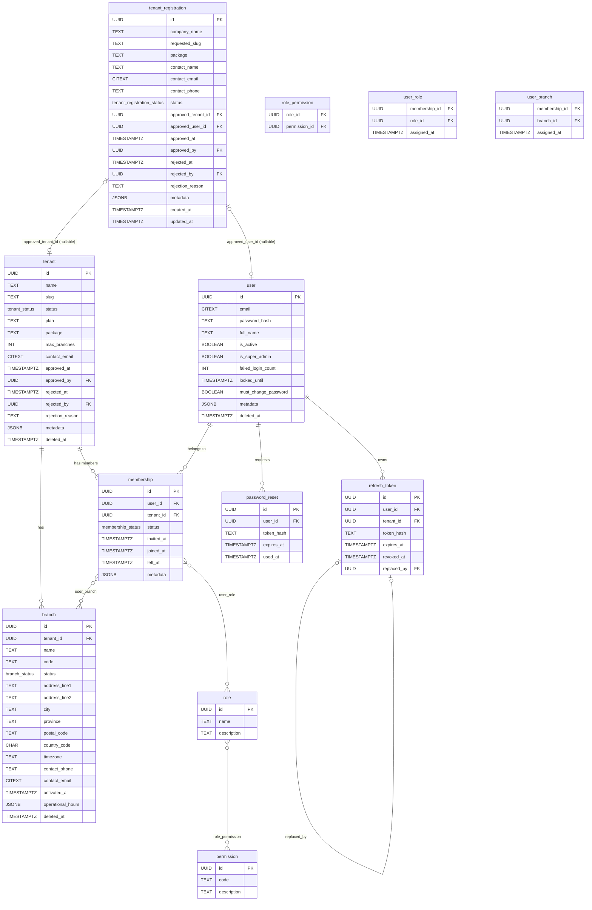
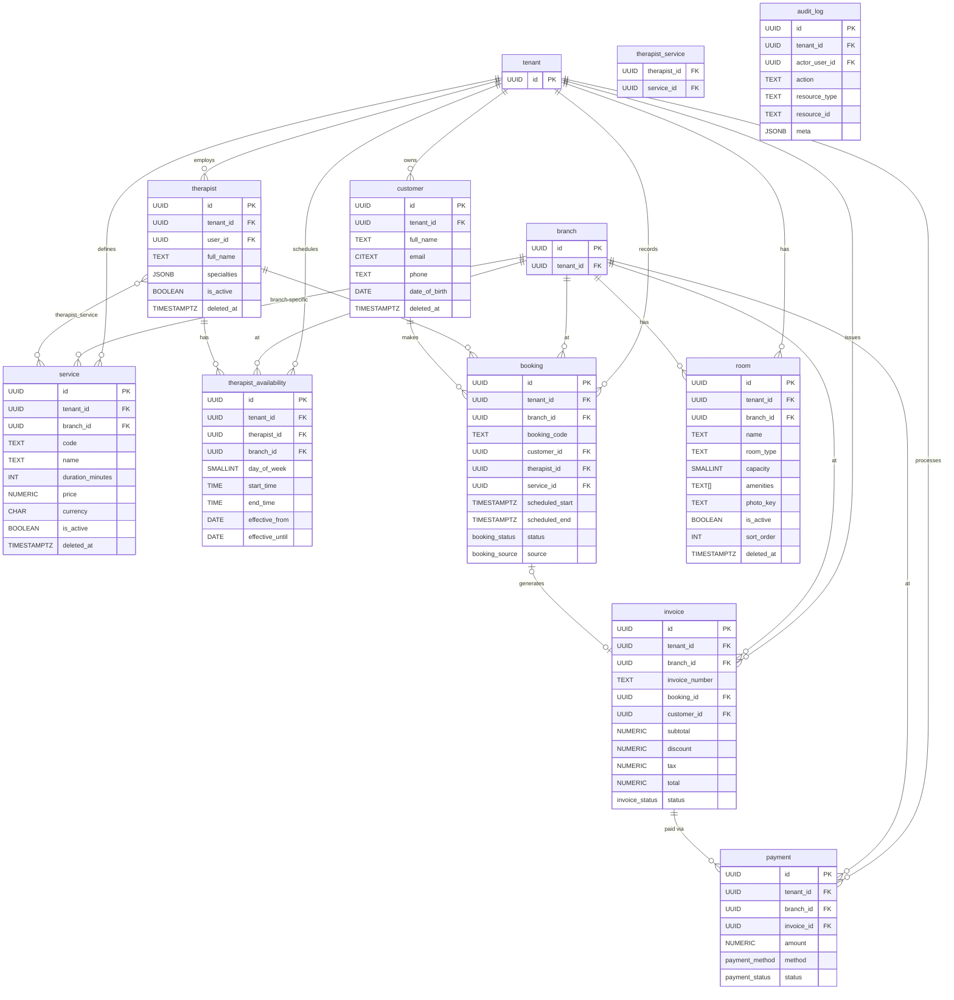
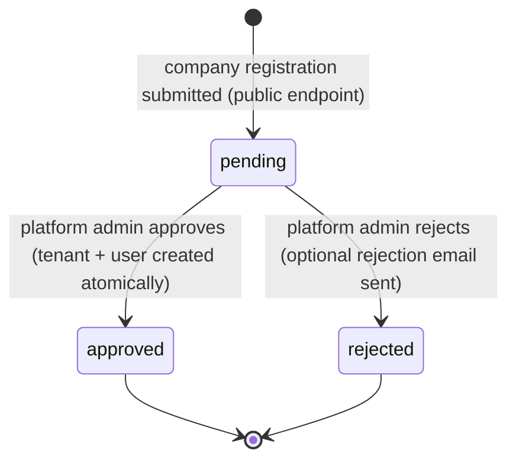
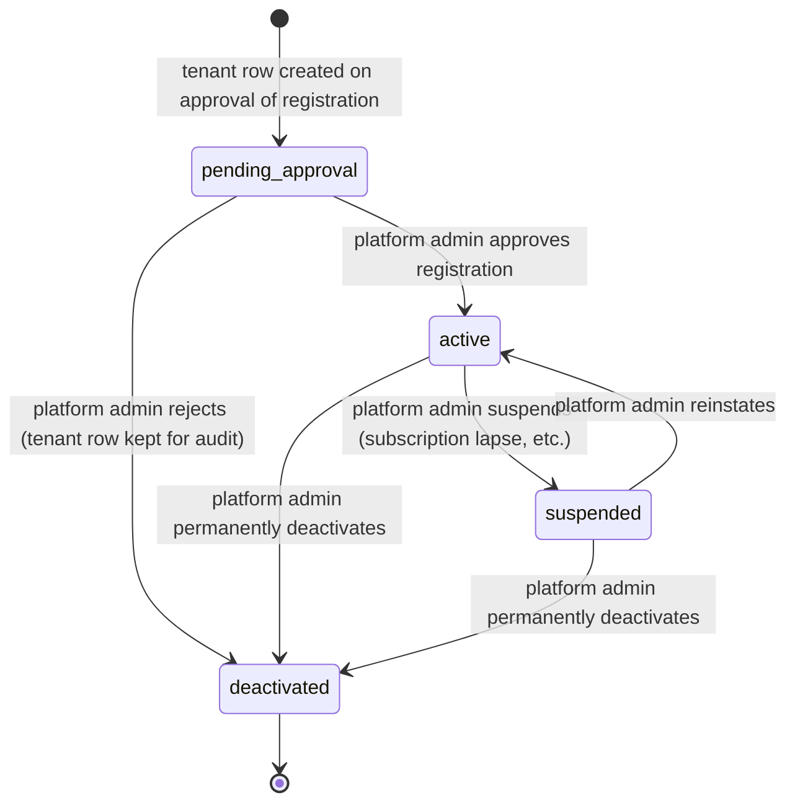
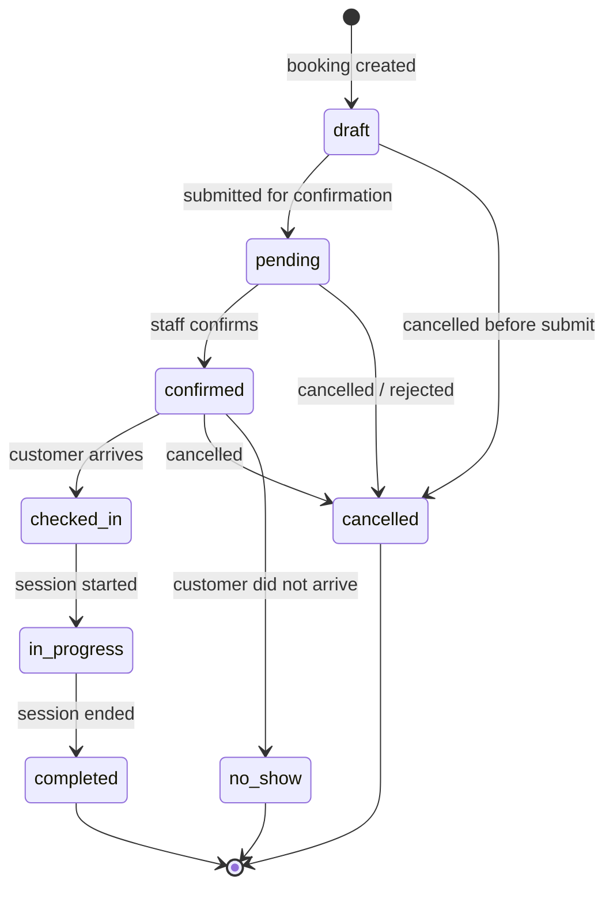
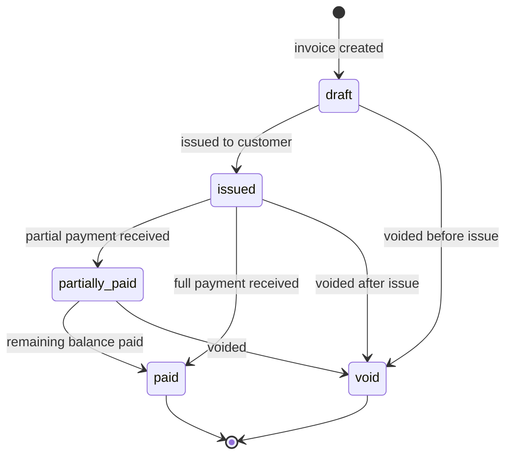
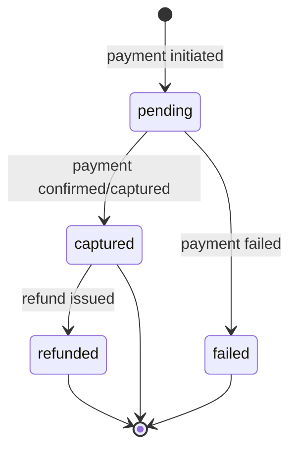
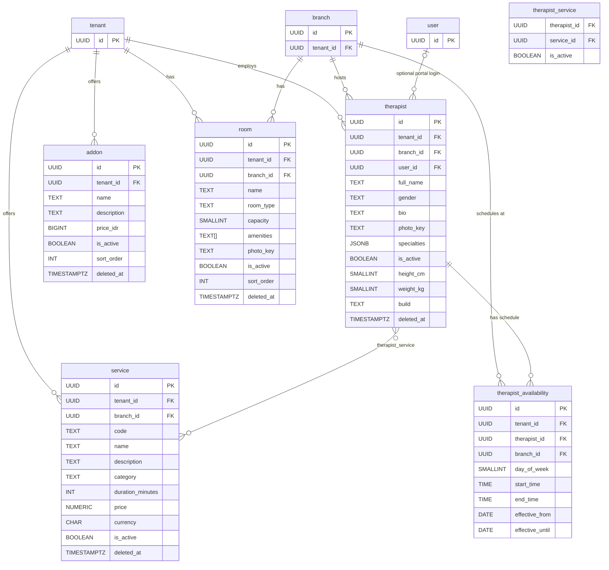

# Data Model — Lustia

_Owned by `db-designer`. Every schema change — new table, column, index, or constraint — must update this file in the same turn as the migration._

_Last updated: 2026-04-25 — ADR 0012 Room catalog / Ruangan (migration 000021)_

---

## 1. Domain Summary

Lustia is a multi-tenant B2B platform for wellness and therapy businesses. The platform owner (a single "super admin" entity) onboards companies (tenants). Each tenant represents one company and may operate one or more physical or logical locations (branches). Within a branch, therapists deliver services to customers via bookings that generate invoices and payments.

The schema is divided into two logical groups. The **access-control group** covers the platform and tenant hierarchy: tenants, branches, the six roles (`super_admin`, `tenant_admin`, `branch_admin`, `finance`, `therapist`, `customer`), fine-grained permissions, users (internal staff, not customers), and authentication artifacts (refresh tokens, password-reset tokens). The **operational group** covers the therapy business: customer records, service catalog, therapist profiles, weekly availability windows, bookings, invoices, and payments. An append-only `audit_log` captures platform and tenant events for compliance.

All operational tables carry `tenant_id` and are isolated by PostgreSQL Row-Level Security (RLS). The DB connection used by the application (`lustia_app`) has RLS enforced; only the migration role (`lustia_migrator`, `BYPASSRLS`) can cross tenant boundaries at the DB level.

---

## 2. ERDs

### 2.1 Access Control Group

_Updated 2026-04-22: ADR 0008 — `tenant_registration` table added; `tenant` extended with package/limits/approval columns; `branch` extended with timezone/activated_at. See also ADR 0007 (migration 000009)._



### 2.2 Operational Group



---

## 3. Table Catalog

Standard audit columns on all tables (unless noted as append-only):

| Column | Type | Notes |
|---|---|---|
| `created_at` | `TIMESTAMPTZ NOT NULL DEFAULT now()` | Set on INSERT |
| `updated_at` | `TIMESTAMPTZ NOT NULL DEFAULT now()` | Auto-updated by `set_updated_at()` trigger |
| `created_by` | `UUID NULL REFERENCES "user"(id)` | Nullable: system/migration can create rows |
| `updated_by` | `UUID NULL REFERENCES "user"(id)` | Nullable |

Soft-delete tables additionally have `deleted_at TIMESTAMPTZ NULL`. Active-row partial indexes use `WHERE deleted_at IS NULL`.

---

### tenant

**Purpose:** One row per company registered on the platform.

| Column | Type | Constraints | Notes |
|---|---|---|---|
| `id` | `UUID` | PK, `DEFAULT gen_random_uuid()` | |
| `name` | `TEXT` | NOT NULL, length 1–200 | Company display name |
| `slug` | `TEXT` | NOT NULL, length 1–100; UNIQUE WHERE deleted_at IS NULL | URL-safe identifier |
| `status` | `tenant_status` | NOT NULL, DEFAULT `pending_approval` | Lifecycle status; see §5.4 |
| `plan` | `TEXT` | NULL, length ≤ 50 | Subscription plan placeholder (legacy; see `package`) |
| `package` | `TEXT` | NOT NULL, DEFAULT `'starter'`; CHECK IN (`starter`,`growth`,`enterprise`) | Onboarding package. Drives `max_branches` default (starter=1, growth=5, enterprise=999). Added migration 000011. |
| `max_branches` | `INT` | NOT NULL, DEFAULT 1; CHECK ≥ 1 | Maximum active branches. Sentinel 999 = unlimited (enterprise). Enforced by service layer, not DB. Added migration 000011. |
| `contact_name` | `TEXT` | NULL | Primary contact |
| `contact_email` | `CITEXT` | NULL, length ≤ 320 | |
| `contact_phone` | `TEXT` | NULL, length ≤ 30 | |
| `approved_at` | `TIMESTAMPTZ` | NULL | Timestamp of platform admin approval. Added migration 000011. |
| `approved_by` | `UUID` | NULL, FK → `"user"(id)` SET NULL | Platform admin who approved. Added migration 000011. |
| `rejected_at` | `TIMESTAMPTZ` | NULL | Timestamp of platform admin rejection. Added migration 000011. |
| `rejected_by` | `UUID` | NULL, FK → `"user"(id)` SET NULL | Platform admin who rejected. Added migration 000011. |
| `rejection_reason` | `TEXT` | NULL, length ≤ 1000 | Freeform reason text. Added migration 000011. |
| `metadata` | `JSONB` | NOT NULL, DEFAULT `{}` | Extensible fields (logo_url, industry, etc.) |
| `deleted_at` | `TIMESTAMPTZ` | NULL | Soft delete |
| _audit columns_ | | | `created_at`, `updated_at`, `created_by`, `updated_by` |

**Indexes:** `tenant_slug_active_uidx` (partial unique), `tenant_status_idx`, `tenant_metadata_gin` (GIN).
**RLS:** None — platform-level table.

---

### branch

**Purpose:** A physical or logical location within a tenant.

| Column | Type | Constraints | Notes |
|---|---|---|---|
| `id` | `UUID` | PK | |
| `tenant_id` | `UUID` | NOT NULL, FK → `tenant(id)` RESTRICT | |
| `name` | `TEXT` | NOT NULL, length 1–200 | |
| `code` | `TEXT` | NULL, length ≤ 50; UNIQUE per tenant WHERE deleted_at IS NULL | Optional short code |
| `status` | `branch_status` | NOT NULL, DEFAULT `active` | Lifecycle; see §5.5 |
| `address_line1` | `TEXT` | NULL | Street address line 1 |
| `address_line2` | `TEXT` | NULL | Street address line 2 |
| `city` | `TEXT` | NULL, length ≤ 100 | |
| `province` | `TEXT` | NULL, length ≤ 100 | |
| `postal_code` | `TEXT` | NULL, length ≤ 20 | |
| `country_code` | `CHAR(2)` | NULL | ISO 3166-1 alpha-2 (e.g. `ID`) |
| `timezone` | `TEXT` | NOT NULL, DEFAULT `'Asia/Jakarta'` | IANA timezone. Used to convert availability windows to UTC. Added migration 000011. Resolves open question #3. |
| `contact_phone` | `TEXT` | NULL, length ≤ 30 | |
| `contact_email` | `CITEXT` | NULL, length 3–320 | |
| `activated_at` | `TIMESTAMPTZ` | NULL | Timestamp of first activation. NULL for never-activated branches. Added migration 000011. |
| `operational_hours` | `JSONB` | NOT NULL, DEFAULT `[]` | Array of `{day, open, close}` |
| `metadata` | `JSONB` | NOT NULL, DEFAULT `{}` | |
| `deleted_at` | `TIMESTAMPTZ` | NULL | |
| _audit columns_ | | | |

**Indexes:** `branch_tenant_id_idx`, `branch_tenant_code_active_uidx` (partial unique), `branch_status_idx`, `branch_metadata_gin`.
**RLS:** `tenant_isolation` policy — reads/writes filtered by `app.current_tenant`.

---

### tenant_registration

**Purpose:** Public registration queue for company onboarding. Each row is a submitted company registration awaiting platform admin review. Platform-level table — not tenant-scoped. Added in migration 000011 (ADR 0008).

| Column | Type | Constraints | Notes |
|---|---|---|---|
| `id` | `UUID` | PK, DEFAULT gen_random_uuid() | |
| `company_name` | `TEXT` | NOT NULL, length 2–200 | |
| `requested_slug` | `TEXT` | NOT NULL, length 2–100; regex `^[a-z0-9][a-z0-9-]*[a-z0-9]$` | Desired tenant slug |
| `package` | `TEXT` | NOT NULL, DEFAULT `'starter'`; CHECK IN (`starter`,`growth`,`enterprise`) | |
| `contact_name` | `TEXT` | NOT NULL, length 1–200 | Submitter's name |
| `contact_email` | `CITEXT` | NOT NULL, length 3–320 | Submitter's email |
| `contact_phone` | `TEXT` | NULL, length 5–30 | |
| `status` | `tenant_registration_status` | NOT NULL, DEFAULT `'pending'` | Enum: `pending`, `approved`, `rejected` |
| `approved_tenant_id` | `UUID` | NULL, FK → `tenant(id)` SET NULL | Set on approval: the created tenant row |
| `approved_user_id` | `UUID` | NULL, FK → `"user"(id)` SET NULL | Set on approval: the created tenant_admin user row |
| `approved_at` | `TIMESTAMPTZ` | NULL | |
| `approved_by` | `UUID` | NULL, FK → `"user"(id)` SET NULL | Platform admin who approved |
| `rejected_at` | `TIMESTAMPTZ` | NULL | |
| `rejected_by` | `UUID` | NULL, FK → `"user"(id)` SET NULL | Platform admin who rejected |
| `rejection_reason` | `TEXT` | NULL, length ≤ 1000 | |
| `metadata` | `JSONB` | NOT NULL, DEFAULT `{}` | IP, user-agent, referral, etc. |
| `created_at` | `TIMESTAMPTZ` | NOT NULL, DEFAULT now() | |
| `updated_at` | `TIMESTAMPTZ` | NOT NULL, DEFAULT now() | Auto-updated by `set_updated_at()` trigger |

**Indexes:**
- `tenant_registration_status_idx`: `(status, created_at)` — primary list query pattern.
- `tenant_registration_pending_email_uidx`: UNIQUE `(contact_email)` WHERE `status = 'pending'` — prevents duplicate pending submissions from the same email.
- `tenant_registration_pending_slug_uidx`: UNIQUE `(requested_slug)` WHERE `status = 'pending'` — prevents slug collisions in the queue.
- `tenant_registration_approved_tenant_id_idx`: partial index on `approved_tenant_id`.
- `tenant_registration_approved_user_id_idx`: partial index on `approved_user_id`.

**RLS:** `tenant_registration_platform_only` — PERMISSIVE FOR ALL, `USING` and `WITH CHECK` require `app.current_tenant = '__platform__'`. The public registration endpoint runs under the platform sentinel; tenant-scoped sessions cannot access this table.

---

### role

**Purpose:** Platform-wide role definitions. Seeded at migration 000005.

| Column | Type | Constraints | Notes |
|---|---|---|---|
| `id` | `UUID` | PK | Fixed UUIDs in seed |
| `name` | `TEXT` | NOT NULL, UNIQUE, length 1–100 | e.g. `super_admin` |
| `description` | `TEXT` | NULL | |
| _audit columns_ | | | |

**RLS:** None — platform-level table.

---

### permission

**Purpose:** Fine-grained permission codes. Seeded at migration 000005. 47 permissions across 13 resource groups.

| Column | Type | Constraints | Notes |
|---|---|---|---|
| `id` | `UUID` | PK | Fixed UUIDs in seed |
| `code` | `TEXT` | NOT NULL, UNIQUE, length 1–100 | e.g. `booking.create` |
| `description` | `TEXT` | NULL | |
| _audit columns_ | | | |

**RLS:** None — platform-level table.

---

### role_permission

**Purpose:** Junction between role and permission. Seeded at migration 000005.

| Column | Type | Constraints | Notes |
|---|---|---|---|
| `role_id` | `UUID` | PK part, FK → `role(id)` CASCADE | |
| `permission_id` | `UUID` | PK part, FK → `permission(id)` CASCADE | |
| `created_at` | `TIMESTAMPTZ` | NOT NULL DEFAULT now() | |
| `created_by` | `UUID` | NULL | |

**Indexes:** `role_permission_permission_id_idx`.
**RLS:** None — platform-level table.

---

### "user"

**Purpose:** Human identity — one row per login identity, independent of tenant. Internal platform users (super admins and all tenant staff). Customers are in the separate `customer` table.

_Updated 2026-04-21: ADR 0007 — `tenant_id` column removed; `is_super_admin` column added; uniqueness model changed to global email. See `membership` table for user–tenant relationships._

| Column | Type | Constraints | Notes |
|---|---|---|---|
| `id` | `UUID` | PK | |
| `email` | `CITEXT` | NOT NULL, length 3–320 | Case-insensitive; globally unique |
| `password_hash` | `TEXT` | NOT NULL | Argon2id encoded string |
| `full_name` | `TEXT` | NOT NULL, length 1–200 | |
| `phone` | `TEXT` | NULL, length ≤ 30 | |
| `avatar_url` | `TEXT` | NULL, length ≤ 2048 | Object-storage URL |
| `is_active` | `BOOLEAN` | NOT NULL, DEFAULT true | |
| `is_super_admin` | `BOOLEAN` | NOT NULL, DEFAULT false | When true: JWT scope=platform, roles=[super_admin] synthesised from flag (no user_role rows needed). Added migration 000009. |
| `last_login_at` | `TIMESTAMPTZ` | NULL | |
| `failed_login_count` | `INT` | NOT NULL, DEFAULT 0 | Brute-force counter |
| `locked_until` | `TIMESTAMPTZ` | NULL | Lockout expiry |
| `must_change_password` | `BOOLEAN` | NOT NULL, DEFAULT false | Added migration 000006. When true, auth-service blocks protected requests until the password is rotated. Set on admin-created and seeded users. |
| `metadata` | `JSONB` | NOT NULL, DEFAULT `{}` | |
| `deleted_at` | `TIMESTAMPTZ` | NULL | Soft delete |
| _audit columns_ | | | |

**Uniqueness:**
- `user_email_uidx`: UNIQUE `(email)` WHERE `deleted_at IS NULL` — one active login identity per email address, globally. Replaces the previous `(tenant_id, email)` + global-null dual-index model.

**Indexes:** `user_is_active_idx`, `user_locked_until_idx`, `user_metadata_gin`.
**RLS:** Three policies (`user_visible`, `user_write`, `user_update`). Visibility: platform scope (`__platform__`) or shared active membership tenant or self (`app.current_user`). Insert restricted to platform scope. Update: platform scope, self, or shared active membership tenant. See §6 for detail.

---

### membership

**Purpose:** Workspace-membership record linking one user identity to one tenant. One row = one human working for (or invited to) one company. Added in migration 000009 (ADR 0007).

| Column | Type | Constraints | Notes |
|---|---|---|---|
| `id` | `UUID` | PK, DEFAULT gen_random_uuid() | |
| `user_id` | `UUID` | NOT NULL, FK → `"user"(id)` CASCADE | |
| `tenant_id` | `UUID` | NOT NULL, FK → `tenant(id)` CASCADE | |
| `status` | `membership_status` | NOT NULL, DEFAULT `active` | Enum: `active`, `suspended`, `invited`, `left` |
| `invited_at` | `TIMESTAMPTZ` | NULL | Set when an invite is issued |
| `joined_at` | `TIMESTAMPTZ` | NOT NULL, DEFAULT now() | When the user accepted / was created |
| `left_at` | `TIMESTAMPTZ` | NULL | Set when status transitions to `left` |
| `metadata` | `JSONB` | NOT NULL, DEFAULT `{}` | |
| `deleted_at` | | (none) | No soft delete; status field carries lifecycle |
| _audit columns_ | | | |

**Uniqueness:** `uq_membership_user_tenant`: UNIQUE `(user_id, tenant_id)` — one membership row per user-tenant pair.

**Indexes:** `membership_tenant_id_idx`, `membership_user_id_idx`, `membership_active_user_idx` (partial WHERE status = 'active').
**RLS:** Three policies (`membership_visible`, `membership_write`, `membership_update`). Visibility: platform scope, or rows whose `tenant_id` matches the session, or rows whose `user_id` matches `app.current_user` (allows a user to enumerate their own memberships before tenant selection). Insert/Update restricted to platform scope or matching tenant. See §6 for detail.

---

### user_role

**Purpose:** Assigns one or more roles to a membership (user within a specific tenant). Re-keyed from `user_id` to `membership_id` in migration 000009.

| Column | Type | Constraints | Notes |
|---|---|---|---|
| `membership_id` | `UUID` | PK part, FK → `membership(id)` CASCADE | Replaces `user_id` (ADR 0007) |
| `role_id` | `UUID` | PK part, FK → `role(id)` RESTRICT | |
| `assigned_at` | `TIMESTAMPTZ` | NOT NULL DEFAULT now() | |
| `assigned_by` | `UUID` | NULL, FK → `"user"(id)` SET NULL | |

**RLS:** Sub-select policy through `membership.tenant_id` (`user_role_visible`, `user_role_write`). Replaced `tenant_isolation` / `tenant_isolation_write` policies in migration 000009.

---

### user_branch

**Purpose:** Many-to-many branch assignment for branch-scoped staff (branch_admin, finance, therapist). Re-keyed from `user_id` to `membership_id` in migration 000009.

| Column | Type | Constraints | Notes |
|---|---|---|---|
| `membership_id` | `UUID` | PK part, FK → `membership(id)` CASCADE | Replaces `user_id` (ADR 0007) |
| `branch_id` | `UUID` | PK part, FK → `branch(id)` CASCADE | |
| `assigned_at` | `TIMESTAMPTZ` | NOT NULL DEFAULT now() | |
| `assigned_by` | `UUID` | NULL, FK → `"user"(id)` SET NULL | |

**RLS:** Sub-select policy through `membership.tenant_id` (`user_branch_visible`, `user_branch_write`). Replaced `tenant_isolation` / `tenant_isolation_write` policies in migration 000009.

---

### refresh_token

**Purpose:** Server-side revocable refresh tokens. Append-only (no `updated_at`). Token rotation: old row's `replaced_by` points to new row.

| Column | Type | Constraints | Notes |
|---|---|---|---|
| `id` | `UUID` | PK | |
| `user_id` | `UUID` | NOT NULL, FK → `"user"(id)` CASCADE | |
| `token_hash` | `TEXT` | NOT NULL, UNIQUE, exactly 64 chars | SHA-256 hex of opaque bearer |
| `issued_at` | `TIMESTAMPTZ` | NOT NULL DEFAULT now() | |
| `expires_at` | `TIMESTAMPTZ` | NOT NULL | |
| `revoked_at` | `TIMESTAMPTZ` | NULL | Set on logout or rotation |
| `replaced_by` | `UUID` | NULL, FK → `refresh_token(id)` SET NULL | Rotation audit chain |
| `user_agent` | `TEXT` | NULL | Request context |
| `ip` | `INET` | NULL | Request IP |
| `created_at` | `TIMESTAMPTZ` | NOT NULL DEFAULT now() | |

**Indexes:** `refresh_token_hash_uidx` (unique), `refresh_token_user_id_idx`, `refresh_token_expires_at_idx`.
**RLS:** Sub-select policy through `"user".tenant_id`.

---

### password_reset

**Purpose:** Short-lived tokens for the forgot-password flow. Shape frozen in Phase 1; endpoints in a later phase.

| Column | Type | Constraints | Notes |
|---|---|---|---|
| `id` | `UUID` | PK | |
| `user_id` | `UUID` | NOT NULL, FK → `"user"(id)` CASCADE | |
| `token_hash` | `TEXT` | NOT NULL, UNIQUE, exactly 64 chars | SHA-256 hex |
| `expires_at` | `TIMESTAMPTZ` | NOT NULL | |
| `used_at` | `TIMESTAMPTZ` | NULL | Set when token consumed |
| `created_at` | `TIMESTAMPTZ` | NOT NULL DEFAULT now() | |

**RLS:** None (tokens are fetched by hash before tenant context is known).

---

### customer

**Purpose:** External customer records scoped to a tenant. Separate from `"user"` because customers are not internal staff and have different lifecycle rules.

| Column | Type | Constraints | Notes |
|---|---|---|---|
| `id` | `UUID` | PK | |
| `tenant_id` | `UUID` | NOT NULL, FK → `tenant(id)` RESTRICT | |
| `full_name` | `TEXT` | NOT NULL, length 1–200 | |
| `email` | `CITEXT` | NULL, length 3–320 | Optional |
| `phone` | `TEXT` | NULL, length ≤ 30 | |
| `date_of_birth` | `DATE` | NULL | |
| `gender` | `TEXT` | NULL, CHECK in (`male`,`female`,`other`,`prefer_not_to_say`) | |
| `address` | `TEXT` | NULL | Free-form; structured address deferred |
| `notes` | `TEXT` | NULL | Internal notes |
| `metadata` | `JSONB` | NOT NULL, DEFAULT `{}` | |
| `deleted_at` | `TIMESTAMPTZ` | NULL | |
| _audit columns_ | | | |

**Uniqueness:**
- `customer_tenant_email_uidx`: UNIQUE `(tenant_id, email)` WHERE `email IS NOT NULL AND deleted_at IS NULL`
- `customer_tenant_phone_uidx`: UNIQUE `(tenant_id, phone)` WHERE `phone IS NOT NULL AND deleted_at IS NULL`

**RLS:** Standard `tenant_id` policy.

---

### service

**Purpose:** A therapy/wellness offering with a price and duration. `branch_id NULL` = tenant-wide; `branch_id` set = branch-specific override.

| Column | Type | Constraints | Notes |
|---|---|---|---|
| `id` | `UUID` | PK | |
| `tenant_id` | `UUID` | NOT NULL, FK → `tenant(id)` RESTRICT | |
| `branch_id` | `UUID` | NULL, FK → `branch(id)` RESTRICT | NULL = tenant-wide |
| `code` | `TEXT` | NOT NULL, length 1–100; UNIQUE per tenant | Human-readable slug |
| `name` | `TEXT` | NOT NULL, length 1–200 | |
| `description` | `TEXT` | NULL | |
| `duration_minutes` | `INT` | NOT NULL, CHECK 1–1440 | |
| `price` | `NUMERIC(12,2)` | NOT NULL, CHECK ≥ 0 | |
| `currency` | `CHAR(3)` | NOT NULL, DEFAULT `IDR` | ISO 4217 |
| `is_active` | `BOOLEAN` | NOT NULL, DEFAULT true | |
| `metadata` | `JSONB` | NOT NULL, DEFAULT `{}` | |
| `deleted_at` | `TIMESTAMPTZ` | NULL | |
| _audit columns_ | | | |

**Uniqueness:** `service_tenant_code_uidx`: UNIQUE `(tenant_id, code)` WHERE `deleted_at IS NULL`.
**RLS:** Standard `tenant_id` policy.

---

### therapist

**Purpose:** Therapist profile. `user_id` is optional — not every therapist needs a portal login.

| Column | Type | Constraints | Notes |
|---|---|---|---|
| `id` | `UUID` | PK | |
| `tenant_id` | `UUID` | NOT NULL, FK → `tenant(id)` RESTRICT | |
| `branch_id` | `UUID` | NOT NULL, FK → `branch(id)` RESTRICT | Branch assignment (migration 000013) |
| `user_id` | `UUID` | NULL, FK → `"user"(id)` SET NULL | Portal login link |
| `full_name` | `TEXT` | NOT NULL, length 1–200 | |
| `gender` | `TEXT` | NULL, CHECK in (`male`,`female`,`other`) | |
| `bio` | `TEXT` | NULL | |
| `photo_key` | `TEXT` | NULL, length ≤ 512 | Opaque storage key — see ADR 0011 (migration 000020) |
| `specialties` | `JSONB` | NOT NULL, DEFAULT `[]` | Array of string tags |
| `is_active` | `BOOLEAN` | NOT NULL, DEFAULT true | |
| `height_cm` | `SMALLINT` | NOT NULL, CHECK 100–250 | Customer-visible (migration 000020) |
| `weight_kg` | `SMALLINT` | NOT NULL, CHECK 30–250 | Customer-visible (migration 000020) |
| `build` | `TEXT` | NOT NULL, CHECK IN (`langsing`,`sedang`,`atletis`,`tegap`) | Customer-visible (migration 000020) |
| `phone` | `TEXT` | NULL | Contact phone (migration 000015) |
| `email` | `TEXT` | NULL | Contact email, distinct from linked user.email (migration 000015) |
| `metadata` | `JSONB` | NOT NULL, DEFAULT `{}` | |
| `deleted_at` | `TIMESTAMPTZ` | NULL | |
| _audit columns_ | | | |

**Indexes:** `therapist_tenant_id_idx`, `therapist_user_id_idx`, `therapist_is_active_idx`, `therapist_specialties_gin` (GIN), `therapist_branch_id_idx` (migration 000013), `therapist_tenant_branch_active_idx` (migration 000013).
**RLS:** Standard `tenant_id` policy.

**`photo_key` semantics:** stores the opaque storage key produced by `Storage.Upload()` (e.g. `therapists/{id}/{16-hex}.ext`). The `Storage` interface resolves this to a public URL at read time (`Storage.URL(ctx, key)`) — see ADR 0011 §2.1. The column never holds a scheme or hostname. `NULL` means no photo has been uploaded.

**`height_cm`, `weight_kg`, `build`:** customer-facing fields displayed in the Phase 5 booking picker so customers can select a preferred therapist. Existing rows were back-filled with placeholder values (`160`, `60`, `sedang`) during migration 000020; the admin UI renders a curation banner on rows that still carry placeholder values.

---

### therapist_service

**Purpose:** Junction table — which services a therapist can deliver.

| Column | Type | Constraints | Notes |
|---|---|---|---|
| `therapist_id` | `UUID` | PK part, FK → `therapist(id)` CASCADE | |
| `service_id` | `UUID` | PK part, FK → `service(id)` CASCADE | |
| `created_at` | `TIMESTAMPTZ` | NOT NULL DEFAULT now() | |
| `created_by` | `UUID` | NULL | |

**Note:** Both therapist and service must belong to the same tenant. This is enforced at the application layer; a DB trigger can be added if needed (open question).
**RLS:** Sub-select policy through `therapist.tenant_id`.

---

### therapist_availability

**Purpose:** Recurring weekly availability windows for a therapist at a specific branch. An `EXCLUDE USING gist` constraint prevents overlapping windows for the same therapist + branch + day.

| Column | Type | Constraints | Notes |
|---|---|---|---|
| `id` | `UUID` | PK | |
| `tenant_id` | `UUID` | NOT NULL, FK → `tenant(id)` RESTRICT | |
| `therapist_id` | `UUID` | NOT NULL, FK → `therapist(id)` CASCADE | |
| `branch_id` | `UUID` | NOT NULL, FK → `branch(id)` RESTRICT | |
| `day_of_week` | `SMALLINT` | NOT NULL, CHECK 0–6 | 0 = Sunday |
| `start_time` | `TIME` | NOT NULL | |
| `end_time` | `TIME` | NOT NULL, CHECK > start_time | |
| `effective_from` | `DATE` | NOT NULL, DEFAULT CURRENT_DATE | |
| `effective_until` | `DATE` | NULL | NULL = indefinite |
| _audit columns_ | | | |

**Constraints:**
- `EXCLUDE USING gist (therapist_id WITH =, branch_id WITH =, day_of_week WITH =, tsrange(…) WITH &&)` — prevents overlapping time windows.
- CHECK `end_time > start_time`
- CHECK `effective_until IS NULL OR effective_until >= effective_from`

**RLS:** Standard `tenant_id` policy.

---

### booking

**Purpose:** Core appointment record. Status lifecycle governed by `booking_status` enum.

| Column | Type | Constraints | Notes |
|---|---|---|---|
| `id` | `UUID` | PK | |
| `tenant_id` | `UUID` | NOT NULL, FK → `tenant(id)` RESTRICT | |
| `branch_id` | `UUID` | NOT NULL, FK → `branch(id)` RESTRICT | |
| `booking_code` | `TEXT` | NOT NULL, length 1–50; UNIQUE per tenant | App-generated human reference |
| `customer_id` | `UUID` | NOT NULL, FK → `customer(id)` RESTRICT | |
| `therapist_id` | `UUID` | NULL, FK → `therapist(id)` RESTRICT | NULL until assigned |
| `service_id` | `UUID` | NOT NULL, FK → `service(id)` RESTRICT | |
| `scheduled_start` | `TIMESTAMPTZ` | NOT NULL | |
| `scheduled_end` | `TIMESTAMPTZ` | NOT NULL, CHECK > start | |
| `status` | `booking_status` | NOT NULL, DEFAULT `draft` | |
| `source` | `booking_source` | NOT NULL, DEFAULT `walk_in` | |
| `notes` | `TEXT` | NULL | |
| `created_by` | `UUID` | NULL, FK → `"user"(id)` SET NULL | Staff who created booking |
| `assigned_at` | `TIMESTAMPTZ` | NULL | When therapist was assigned |
| `started_at` | `TIMESTAMPTZ` | NULL | Session start |
| `ended_at` | `TIMESTAMPTZ` | NULL | Session end |
| `cancelled_at` | `TIMESTAMPTZ` | NULL | |
| `cancellation_reason` | `TEXT` | NULL | |
| `metadata` | `JSONB` | NOT NULL, DEFAULT `{}` | |
| _audit columns_ | | | `created_at`, `updated_at`, `updated_by` |

**Constraints:**
- `EXCLUDE USING gist (therapist_id WITH =, tstzrange(scheduled_start, scheduled_end) WITH &&) WHERE (therapist_id IS NOT NULL AND status NOT IN ('cancelled','no_show'))` — DB-level double-booking prevention.
- CHECK `cancelled_at IS NOT NULL` when `status = 'cancelled'`.

**Indexes:** `booking_tenant_branch_start_idx`, `booking_tenant_customer_idx`, `booking_tenant_therapist_start_idx`, `booking_status_idx`, `booking_tenant_code_uidx` (unique), `booking_metadata_gin`.
**RLS:** Standard `tenant_id` policy.

---

### invoice

**Purpose:** Financial document. Typically generated from a booking; can also be standalone.

| Column | Type | Constraints | Notes |
|---|---|---|---|
| `id` | `UUID` | PK | |
| `tenant_id` | `UUID` | NOT NULL, FK → `tenant(id)` RESTRICT | |
| `branch_id` | `UUID` | NOT NULL, FK → `branch(id)` RESTRICT | |
| `invoice_number` | `TEXT` | NOT NULL, UNIQUE per tenant | App-generated reference |
| `booking_id` | `UUID` | NULL, FK → `booking(id)` RESTRICT | Nullable for ad-hoc invoices |
| `customer_id` | `UUID` | NOT NULL, FK → `customer(id)` RESTRICT | |
| `subtotal` | `NUMERIC(12,2)` | NOT NULL, CHECK ≥ 0 | |
| `discount` | `NUMERIC(12,2)` | NOT NULL, DEFAULT 0, CHECK ≥ 0 | |
| `tax` | `NUMERIC(12,2)` | NOT NULL, DEFAULT 0, CHECK ≥ 0 | |
| `total` | `NUMERIC(12,2)` | NOT NULL, CHECK ≥ 0 | |
| `currency` | `CHAR(3)` | NOT NULL, DEFAULT `IDR` | |
| `status` | `invoice_status` | NOT NULL, DEFAULT `draft` | |
| `issued_at` | `TIMESTAMPTZ` | NULL | |
| `due_at` | `TIMESTAMPTZ` | NULL | |
| `paid_at` | `TIMESTAMPTZ` | NULL | |
| `metadata` | `JSONB` | NOT NULL, DEFAULT `{}` | |
| _audit columns_ | | | |

**RLS:** Standard `tenant_id` policy.

---

### payment

**Purpose:** One payment attempt or capture per row. An invoice can have multiple rows (partial payments, retries).

| Column | Type | Constraints | Notes |
|---|---|---|---|
| `id` | `UUID` | PK | |
| `tenant_id` | `UUID` | NOT NULL, FK → `tenant(id)` RESTRICT | |
| `branch_id` | `UUID` | NOT NULL, FK → `branch(id)` RESTRICT | |
| `invoice_id` | `UUID` | NOT NULL, FK → `invoice(id)` RESTRICT | |
| `amount` | `NUMERIC(12,2)` | NOT NULL, CHECK > 0 | |
| `currency` | `CHAR(3)` | NOT NULL, DEFAULT `IDR` | |
| `method` | `payment_method` | NOT NULL | |
| `gateway_reference` | `TEXT` | NULL, length ≤ 500 | External transaction ID |
| `status` | `payment_status` | NOT NULL, DEFAULT `pending` | |
| `paid_at` | `TIMESTAMPTZ` | NULL | |
| `metadata` | `JSONB` | NOT NULL, DEFAULT `{}` | |
| _audit columns_ | | | |

**RLS:** Standard `tenant_id` policy.

---

### audit_log

**Purpose:** Append-only compliance event log. No `updated_at`, no soft delete — immutable by design.

| Column | Type | Constraints | Notes |
|---|---|---|---|
| `id` | `UUID` | PK | |
| `tenant_id` | `UUID` | NULL, FK → `tenant(id)` RESTRICT | NULL for platform events |
| `actor_user_id` | `UUID` | NULL, FK → `"user"(id)` SET NULL | NULL for system actions |
| `action` | `TEXT` | NOT NULL, length 1–100 | e.g. `booking.created` |
| `resource_type` | `TEXT` | NOT NULL, length 1–100 | e.g. `booking` |
| `resource_id` | `TEXT` | NULL, length ≤ 100 | UUID as string |
| `meta` | `JSONB` | NOT NULL, DEFAULT `{}` | Before/after state, context |
| `created_at` | `TIMESTAMPTZ` | NOT NULL DEFAULT now() | |

**Indexes:** `audit_log_tenant_id_idx`, `audit_log_actor_user_id_idx`, `audit_log_resource_idx`, `audit_log_created_at_idx`, `audit_log_meta_gin`.
**RLS:** None — platform-level table. Super admin reads all; app layer filters by tenant_id for tenant-scoped views.

---

## 4. Role → Permission Matrix

| Permission | `super_admin` | `tenant_admin` | `branch_admin` | `finance` | `therapist` | `customer` |
|---|:---:|:---:|:---:|:---:|:---:|:---:|
| `tenant.read` | Y | Y | — | — | — | — |
| `tenant.create` | Y | — | — | — | — | — |
| `tenant.update` | Y | Y | — | — | — | — |
| `tenant.delete` | Y | Y | — | — | — | — |
| `tenant.approve` | Y | — | — | — | — | — |
| `branch.read` | Y | Y | Y | — | — | — |
| `branch.create` | Y | Y | — | — | — | — |
| `branch.update` | Y | Y | — | — | — | — |
| `branch.delete` | Y | Y | — | — | — | — |
| `user.read` | Y | Y | Y | — | — | — |
| `user.create` | Y | Y | Y | — | — | — |
| `user.update` | Y | Y | Y | — | — | — |
| `user.delete` | Y | Y | — | — | — | — |
| `user.assign_role` | Y | Y | — | — | — | — |
| `role.read` | Y | Y | — | — | — | — |
| `role.create` | Y | — | — | — | — | — |
| `role.update` | Y | — | — | — | — | — |
| `role.delete` | Y | — | — | — | — | — |
| `permission.read` | Y | Y | — | — | — | — |
| `permission.manage` | Y | — | — | — | — | — |
| `customer.read` | Y | Y | Y | Y | — | Y (own) |
| `customer.create` | Y | Y | Y | — | — | — |
| `customer.update` | Y | Y | Y | — | — | — |
| `customer.delete` | Y | Y | Y | — | — | — |
| `therapist.read` | Y | Y | Y | — | — | Y |
| `therapist.create` | Y | Y | Y | — | — | — |
| `therapist.update` | Y | Y | Y | — | — | — |
| `therapist.delete` | Y | Y | Y | — | — | — |
| `service.read` | Y | Y | Y | — | Y | Y |
| `service.create` | Y | Y | Y | — | — | — |
| `service.update` | Y | Y | Y | — | — | — |
| `service.delete` | Y | Y | Y | — | — | — |
| `availability.read` | Y | Y | Y | — | Y | — |
| `availability.create` | Y | Y | Y | — | Y (own) | — |
| `availability.update` | Y | Y | Y | — | Y (own) | — |
| `availability.delete` | Y | Y | Y | — | Y (own) | — |
| `booking.read` | Y | Y | Y | Y | Y (own) | Y (own) |
| `booking.create` | Y | Y | Y | — | — | Y |
| `booking.update` | Y | Y | Y | — | — | — |
| `booking.cancel` | Y | Y | Y | — | — | Y (own) |
| `booking.checkin` | Y | Y | Y | — | Y | — |
| `booking.complete` | Y | Y | Y | — | Y | — |
| `invoice.read` | Y | Y | Y | Y | — | — |
| `invoice.create` | Y | Y | Y | Y | — | — |
| `invoice.update` | Y | Y | — | Y | — | — |
| `invoice.void` | Y | Y | — | Y | — | — |
| `payment.read` | Y | Y | — | Y | — | — |
| `payment.record` | Y | Y | — | Y | — | — |
| `report.read` | Y | Y | — | Y | — | — |
| `report.export` | Y | Y | — | Y | — | — |
| `addon.read` | Y | Y | Y | — | — | — |
| `addon.create` | Y | Y | — | — | — | — |
| `addon.update` | Y | Y | — | — | — | — |
| `addon.delete` | Y | Y | — | — | — | — |
| `room.read` | Y | Y | Y | — | — | — |
| `room.create` | Y | Y | Y† | — | — | — |
| `room.update` | Y | Y | Y† | — | — | — |
| `room.delete` | Y | Y | Y† | — | — | — |

_Notes:_
- `branch_admin` scope is limited to their assigned branch(es) — enforced at the application layer after the permission check.
- `therapist` and `customer` "own" access is an application-layer filter on top of the permission check (e.g. `WHERE therapist_id = current_user_id`).
- † `branch_admin` holds all 4 `room.*` permissions at the DB level. The service layer (`RoomService`) enforces that mutations are restricted to rooms whose `branch_id` is in the caller's assigned branches. This matches the `TherapistService` pattern from Phase 4. See ADR 0012 §2.2.

---

## 5. Status Lifecycles

### 5.1 Tenant Registration Status

_Added 2026-04-22 — ADR 0008. Each row in `tenant_registration` starts as `pending` and transitions exactly once._



### 5.2 Tenant Status

_Added 2026-04-22 — ADR 0008. State transitions enforced in the service layer (not via DB CHECK — Postgres CHECK cannot read OLD values). `go-expert` implements the transition table._



Note: Transition to `deactivated` also cascades all memberships to `suspended` status. This cascade is enforced by the service layer (`go-expert` scope), not by a DB trigger.

### 5.3 Branch Status

_Added 2026-04-22 — ADR 0008. Enforced in service layer._

```mermaid
stateDiagram-v2
    [*] --> inactive : branch created (default status)
    inactive --> active : tenant_admin activates (sets activated_at on first transition)
    active --> inactive : tenant_admin deactivates
    inactive --> deleted : tenant_admin soft-deletes (sets deleted_at; branch remains for audit)
    deleted --> [*]
```



### 5.4 Booking Status



### 5.5 Invoice Status



### 5.6 Payment Status



---

## 6. RLS Strategy

### How `app.current_tenant` is set

At the start of every request, the auth middleware runs within a transaction and calls:

```sql
SET LOCAL app.current_tenant = '<tenant_uuid>';
SET LOCAL app.current_user   = '<user_uuid>';
```

`SET LOCAL` scopes the setting to the current transaction. When the transaction ends (commit or rollback), the setting is cleared. This means there is no risk of a setting "leaking" between requests on a connection pool connection.

### What happens when the setting is absent

All RLS `USING` clauses use `current_setting('app.current_tenant', true)`. The second argument `true` means "return NULL if the setting does not exist" (rather than raising an error). A NULL on the right side of the equality check causes the predicate to evaluate to NULL (not TRUE), which means **no rows pass the filter**. The result is an empty result set, not an error and not a data leak. This is the safe-fail behavior.

### Super admin bypass

Super admin requests set `app.current_tenant = '__platform__'` rather than a real tenant UUID. The `"user"` table `user_visible` policy includes an explicit `OR` branch that passes when the current_tenant sentinel is `'__platform__'`. Super admin identity is now expressed by `user.is_super_admin = true` (not by `tenant_id IS NULL`), added in migration 000009.

The `lustia_migrator` DB role has `BYPASSRLS` and is used exclusively for DDL migrations — never for application traffic.

A dedicated `lustia_super_admin` DB role with `BYPASSRLS` can be added if the sentinel approach is found insufficient after security review.

### "user" and membership RLS policies (post-ADR 0007)

**`"user"` table** — three policies (`user_visible`, `user_write`, `user_update`):

- `user_visible` (SELECT): a row is visible when `app.current_tenant = '__platform__'` OR the user has at least one active membership in the current session's tenant OR the row's `id` matches `app.current_user` (self-visibility for `/auth/me` with `scope=user`).
- `user_write` (INSERT): restricted to `app.current_tenant = '__platform__'` only. Tenant admins creating users do so through the platform layer which sets the platform sentinel for the user creation step.
- `user_update` (UPDATE): platform scope, self-update, or an active membership in the current session's tenant (allows tenant admins to update staff profiles within their tenant).

**`membership` table** — three policies (`membership_visible`, `membership_write`, `membership_update`):

- `membership_visible` (SELECT): platform scope, or the row's `tenant_id` matches the session, or the row's `user_id` matches `app.current_user` (allows a user to enumerate their own memberships regardless of which tenant scope the session has — necessary for the login → select-tenant flow).
- `membership_write` (INSERT): platform scope or matching tenant scope.
- `membership_update` (UPDATE): platform scope or matching tenant scope (tenant admins can suspend/reactivate members in their own tenant).

### Tables without RLS

`tenant`, `role`, `permission`, `role_permission`, `audit_log` are platform-level tables. They do not carry a meaningful `tenant_id` filter from the application's perspective — `super_admin` needs to read all tenants, all roles, all permissions. Application-layer RBAC (role + permission check in middleware) is the gate for these tables. `lustia_app` has read-only access to role/permission/role_permission; write access to tenant requires the `super_admin` role.

---

## 7. Design Decisions

### Shared schema + RLS over schema-per-tenant

Lustia targets hundreds to thousands of tenants. Schema-per-tenant would require running every DDL migration once per schema — an operational burden that grows with tenant count and introduces divergence risk. Shared schema with RLS provides the same isolation at the DB level with a single migration file. See [ADR 0001](DECISIONS/0001-multi-tenancy-rls.md) for the full analysis.

### DB-level exclusion constraint for booking double-booking prevention

A `SELECT … WHERE overlaps … THEN INSERT` pattern has a TOCTOU race condition under concurrent load. A PostgreSQL GiST exclusion constraint enforces the invariant atomically as part of the INSERT/UPDATE, covering all code paths without relying on application developers to remember the check. See [ADR 0002](DECISIONS/0002-booking-double-booking-prevention.md).

### UUIDv4 now, UUIDv7 later

`gen_random_uuid()` (UUIDv4) is used for all primary keys. Random UUIDs cause page splits on B-tree indexes for large tables. UUIDv7 (time-ordered) would reduce write amplification. The decision was made to use UUIDv4 now because: (a) Phase 1 tables will not approach the size where this matters, (b) `gen_random_uuid()` is available without any external extension, and (c) the application can generate UUIDv7 client-side (`github.com/google/uuid`) and pass it on INSERT when performance data warrants the change. The PK type (`UUID`) does not change — only the default function.

### Soft delete on selected tables only

Soft delete (`deleted_at TIMESTAMPTZ NULL`) is applied to: `tenant`, `branch`, `user`, `customer`, `therapist`, `service`. These are entities where deletion is rare, reversibility is valuable, and audit history matters. Operational records (`booking`, `invoice`, `payment`) use status fields instead — a cancelled booking or voided invoice retains its history without a soft-delete pattern. `audit_log` is immutable by design.

### User–Membership Pattern (ADR 0007, migration 000009)

The original "one user row per tenant" model required Alice to have two accounts if she worked at two companies. Migration 000009 replaces this with the workspace-membership pattern: `user` holds global identity; `membership` holds per-tenant relationships. Login uses email+password only; tenant selection is a separate post-login step. `user_role` and `user_branch` are re-keyed to `membership_id` so roles are scoped to a specific tenant context. Super admin identity is expressed by `user.is_super_admin = true` (not by `tenant_id IS NULL`). All active refresh tokens are revoked at the end of the migration, forcing a clean re-login with the new JWT shape (`membership_id`, `scope` claims).

### Tenant onboarding via registration queue (ADR 0008)

Phase 3 introduces `tenant_registration` as a public-facing queue separate from the `tenant` table. The separation is intentional: an unreviewed submission must not become a `tenant` row until a platform admin explicitly approves it. The `tenant_registration` table is platform-level (no `tenant_id`, RLS enforces the `__platform__` sentinel), keeping it invisible to tenant-scoped sessions. On approval, the service layer creates the `tenant`, `user`, and `membership` rows atomically in one transaction and updates the registration row with `approved_tenant_id` / `approved_user_id` for a complete audit trail. See [ADR 0008](DECISIONS/0008-tenant-onboarding-and-branch-setup.md).

### Tenant/branch status transitions enforced in service layer

The `tenant_status` and `branch_status` state machines (§5.2, §5.3) are NOT enforced via `CHECK` constraints because Postgres `CHECK` constraints cannot compare `NEW` and `OLD` values. The service layer (`go-expert` scope) implements an explicit transition table that returns `409 INVALID_STATUS_TRANSITION` for illegal moves. Deactivation of a tenant cascades membership status to `suspended` — this cascade is also service-layer logic, not a DB trigger, because it crosses two tables and benefits from transactional error handling. See ADR 0008 §5, answer #4.

### Dev-only seed migrations (000010, 000012, 000014, 000019)

Migration `000010_seed_dev_data.up.sql` inserts the `acme-spa` tenant (`d0000000-0000-0000-0001-000000000001`) and `alice@acme-spa.example` with `tenant_admin` membership. Migration `000012_seed_dev_registrations.up.sql` inserts one sample `pending` registration (Zen Wellness) for testing the platform-admin approval queue. Migration `000014_seed_dev_master_data.up.sql` seeds one branch, three services, two therapists, and their availability windows under acme-spa. Migration `000019_seed_dev_addons.up.sql` seeds four tenant-level add-ons under acme-spa. Migration `000022_seed_dev_rooms.up.sql` seeds three rooms (VIP 1, Couple A, Single 1) for acme-spa Cabang Utama.

All five seed migrations are **dev-only** and must not be applied in staging or production. In those environments, stop the migration runner at step 21:

```
migrate -database "$DATABASE_URL" -path ./migrations up 21
```

Or omit the `000010_*.sql`, `000012_*.sql`, `000014_*.sql`, `000019_*.sql`, and `000022_*.sql` files from the production image.

All seed migrations are idempotent (`ON CONFLICT DO NOTHING`) and use fixed UUIDs (`d0000000-…` for migration 010, `e0000000-…` for migrations 012 and 022, `f0000000-…` for migrations 014 and 019). The Argon2id hash for `Staff2026!` is stored as a literal constant in migration 010; regenerate with `go run ./cmd/argon2hash 'Staff2026!'`.

### `"user"` table separate from `customer` table

Internal staff (super_admin, tenant_admin, branch_admin, finance, therapist) have fundamentally different lifecycle rules from external customers. Staff have roles, permissions, login credentials, and branch assignments. Customers have date-of-birth, gender, and booking histories but (in early phases) no platform login. Merging them into one table would require nullable columns for both sets of attributes and complicate role assignment. Separation keeps each table's purpose clear. A foreign key from `therapist.user_id` to `"user"` bridges the gap when a therapist also has a portal login.

### Enum type catalog

All enum types defined across the migration chain:

| Type | Values | Defined in |
|---|---|---|
| `tenant_status` | `pending_approval`, `active`, `suspended`, `deactivated` | migration 000001 |
| `branch_status` | `active`, `inactive` | migration 000001 |
| `booking_status` | `draft`, `pending`, `confirmed`, `checked_in`, `in_progress`, `completed`, `cancelled`, `no_show` | migration 000001 |
| `booking_source` | `walk_in`, `online`, `phone` | migration 000001 |
| `invoice_status` | `draft`, `issued`, `partially_paid`, `paid`, `void` | migration 000001 |
| `payment_method` | `cash`, `card`, `transfer`, `qris`, `gateway` | migration 000001 |
| `payment_status` | `pending`, `captured`, `failed`, `refunded` | migration 000001 |
| `membership_status` | `active`, `suspended`, `invited`, `left` | migration 000009 |
| `tenant_registration_status` | `pending`, `approved`, `rejected` | migration 000011 |

### Native Postgres enums for status fields

Status and source fields (`booking_status`, `invoice_status`, etc.) use native `CREATE TYPE … AS ENUM` rather than lookup tables. These values are defined by the application's state machine, not by operators. Enums provide DB-level type safety, self-documentation via `\dT+`, and efficient storage. Adding a new value is a non-blocking `ALTER TYPE … ADD VALUE`. See [ADR 0004](DECISIONS/0004-enum-type-vs-lookup-table.md).

### Bootstrap super admin via placeholder hash

The seed migration inserts the platform super admin with an unusable placeholder Argon2id hash. The operator sets a real password via a post-migration SQL step. This avoids env-variable interpolation in migration files (not supported by `golang-migrate` natively) while keeping the account structurally present and the migration deterministic. See [ADR 0003](DECISIONS/0003-bootstrap-super-admin.md).

### `JSONB` for operational_hours, specialties, and metadata

`operational_hours` on `branch` is a structured array (`[{day, open, close}]`) that varies in length and is always read/written as a whole document — a natural JSONB fit. `specialties` on `therapist` is a tag array; if tag-based filtering becomes a top query, promote to a `therapist_specialty` child table. `metadata` on every table is an escape hatch for tenant-specific attributes that do not yet warrant first-class columns.

### `INET` type for IP address in `refresh_token`

PostgreSQL's native `INET` type stores IPv4 and IPv6 addresses efficiently and enables subnet containment queries. It is preferable to storing IPs as `TEXT`.

### Room catalog — `amenities` as `TEXT[]` not a lookup table (ADR 0012 §3.1)

`room.amenities` is a `TEXT[]` column rather than a separate `room_amenity` lookup table or an `amenity` entity with FKs. Rationale: amenity labels are operator-defined (tenant-specific), vary freely, and are always read/written as a complete set with no per-row metadata. A lookup table would add a join on every room read and require a management UI just to define tags. The Postgres array type with GIN indexing is sufficient for any future array-contains queries. If standardized amenity codes with multilingual labels become a requirement, a lookup table can be added without breaking the array column (which can be retained or migrated).

### Room `branch_id` FK is `RESTRICT`, not `CASCADE` (ADR 0012 §2.1)

Rooms are physical assets: if a branch is removed while rooms still exist, silently deleting the rooms (and potentially future bookings attached to them) would cause data loss without operator awareness. `RESTRICT` forces an explicit resolution — the operator must soft-delete or reassign all rooms before the branch can be removed. This is the same reasoning as `therapist.branch_id ON DELETE RESTRICT`.

### No `resource` abstraction in Phase 4 (ADR 0012 §2.6)

A generic `resource` super-type table was considered (to unify rooms, equipment, stations) but deferred as YAGNI. `room.id` is sufficient as the booking-engine resource handle for Phase 5. Adding a `resource` abstraction in a later phase is additive — the FK on `booking.room_id` would migrate to `booking.resource_id` when and if the abstraction is needed.

### Room UUID permission namespace `c0000000-0000-0000-0021-*` (ADR 0012 §2.2)

The `0021` suffix matches the migration number. Before writing migration 000021, the entire `lustia/migrations/` directory was grepped for the prefix — zero matches confirmed. The lesson from migration 000018 (where `c0000000-0000-0000-0010-*` collided with existing `booking.*` permissions) is applied here by always verifying the namespace before use.

---

## 8. Open Questions

1. **`must_change_password` column on `"user"`:** ✅ Resolved 2026-04-21 — added in migration `000006_user_must_change_password` with `DEFAULT false`. Bootstrap super admin flipped to `true`. Auth-service enforcement is now a follow-up for `go-expert` (block protected requests and return `PASSWORD_CHANGE_REQUIRED` until the password is rotated).

2. **Cross-tenant check on `therapist_service`:** Both `therapist_id` and `service_id` must belong to the same tenant. Currently enforced at the application layer only. A DB trigger can add a hard constraint. Decision: add trigger in a future migration if cross-tenant contamination incidents occur.

3. **`therapist` availability: timezone handling.** ✅ Resolved 2026-04-22 — ADR 0008 adds `branch.timezone TEXT NOT NULL DEFAULT 'Asia/Jakarta'` (migration 000011). The application uses this column when converting `therapist_availability.start_time`/`end_time` to absolute UTC slots. IANA timezone string validation is the application's responsibility.

4. **`booking_code` and `invoice_number` generation.** These are app-generated human-readable codes (e.g. `BKG-20240418-001`). The DB uniqueness constraint catches collisions. Define the generation algorithm in `go-expert` scope to avoid race conditions (e.g. use a `SEQUENCE` per tenant, or a padded `COUNT(*)+1`).

5. **`audit_log` partitioning.** `audit_log` will grow unboundedly. No partitioning is in place for Phase 1. Recommend adding `PARTITION BY RANGE (created_at)` with monthly partitions before production launch, or implementing an archival policy (move rows older than N months to cold storage).

6. **`super_admin` DB role strategy.** Currently super_admin application requests use the `lustia_app` connection with `app.current_tenant = '__platform__'` sentinel. An alternative is a dedicated `lustia_super_admin` DB role with `BYPASSRLS`. The sentinel approach is simpler for connection pooling. Confirm with `security-expert`.

7. **Refresh token cleanup job.** Expired and revoked refresh tokens accumulate in the table. A periodic cleanup job (DELETE WHERE `expires_at < now() - interval '30 days'`) should be scheduled. Flag for `go-expert` / operations.

8. **`password_reset` table — RLS decision.** Currently no RLS on `password_reset` because tokens are fetched by hash before tenant context is established. This is intentional but should be confirmed with `security-expert` — specifically whether a token hash lookup could be exploited to enumerate users across tenants.

9. **Global email uniqueness:** ✅ Resolved 2026-04-21 — ADR 0007 mandates `UNIQUE (email) WHERE deleted_at IS NULL` on the `"user"` table (index `user_email_uidx`), replacing the previous per-tenant uniqueness model. One email address = one login identity across the entire platform. Implemented in migration 000009.

---

## Phase 4 — Master Operational Data

_Added 2026-04-22 — ADR 0009 (migration 000013). Tables `therapist`, `service`, `therapist_service`, and `therapist_availability` were structurally created in migration 000003 and RLS-enabled in migration 000004. Migration 000013 extends them with the columns required for Phase 4 operational semantics: `therapist.branch_id`, `service.category`, and `therapist_service.is_active`._

---

### Phase 4 — ERD Snippet

The four Phase 4 tables and their relationships to `tenant`, `branch`, and `user`:



**Relationship notes:**
- `service.branch_id` is nullable — NULL means the service is tenant-wide (the normal Phase 4 case). A non-null value would indicate a branch-specific override (reserved for future phases).
- `therapist.user_id` is nullable — a therapist without a portal account has no `user` row. When set, it links to the global `user` table; same-tenant enforcement is at the service layer (see Q3 resolution below).
- `therapist_service` is a true business entity, not just a junction: it carries `is_active` to model temporary suspension of an offering without destroying the mapping.
- `addon` is tenant-wide — no relationship to `service` at the catalog level. Phase 5 booking engine records selected add-ons on the booking row; the catalog itself carries no per-service restriction.

---

### Phase 4 — Open Question Resolutions (ADR 0009)

**Q1 — Availability granularity:** TIME columns with minute precision.

Decision: use `TIME` (PostgreSQL `time without time zone`) for `start_time` and `end_time`. This gives 1-minute granularity. The tradeoff considered was TIME vs a SMALLINT slot enum (e.g. 15-minute slots numbered 0–95). TIME wins because:

1. It imposes no artificial rounding at the DB layer — if a tenant wants 10:00–11:45 that is representable without change.
2. The weekly availability editor UI rounds to 15- or 30-minute steps in the application; the DB does not need to enforce that rounding, making it easier to relax later.
3. The GiST exclusion constraint already normalises the TIME values to a TSRANGE over a fixed date (2000-01-01) for overlap detection — slot enums would require bespoke range arithmetic there anyway.

UX implication for `go-expert` and `nextjs-expert`: the API should accept `"HH:MM"` strings and validate they fall on the desired step boundary (e.g. multiples of 15 minutes) in the service layer. The DB stores whatever valid TIME value the service layer sends; the constraint only rejects overlaps and end <= start.

**Q2 — Service duration:** fixed single `duration_minutes INT NOT NULL CHECK (duration_minutes > 0 AND duration_minutes <= 1440)`.

Decision: confirmed as per ADR 0009 default. A single integer is sufficient for Phase 4. Variable ranges (e.g. "60–90 minutes depending on therapist pace") are a Phase 5+ enhancement. The booking engine will use `scheduled_end = scheduled_start + duration_minutes * interval '1 minute'` to compute the end time; no schema change will be needed when that logic is added.

**Q3 — `therapist.user_id` — same-tenant constraint:** service-layer enforcement only.

Decision: enforce same-tenant membership at the service layer; no DB constraint. Rationale:

1. A DB constraint would require either a trigger that JOINs `therapist` → `tenant` and `user` → `membership` → `tenant`, or a generated column trick. Both approaches are fragile across future schema changes and are hard to debug under RLS.
2. The service layer already validates that `user_id` refers to a user with an active membership in the creating session's tenant before inserting the `therapist` row. This is the same pattern used for `booking.customer_id` and other cross-table consistency checks.
3. A violation (linking a therapist to a user from a different tenant) cannot occur through the normal API because RLS ensures the session can only see users in its own tenant. The risk exists only if a bug bypasses the service layer — mitigated by integration tests.

The open question from migration 000003 ("a DB trigger can be added if needed") remains deferred. If cross-tenant contamination incidents occur in production, add a trigger in a new migration. This is tracked in §8 Open Question #2 (unchanged).

**Q4 — Soft-delete semantics / therapist deletion cascade (ADR 0009 §3 item 4):** soft-delete only; hard delete is blocked.

Decision: `therapist.deleted_at` follows the project's soft-delete pattern. The service layer must:
- Block hard DELETE on `therapist` entirely (the `lustia_app` DB role has no DELETE grant on `therapist`; existing grants are SELECT/INSERT/UPDATE from migration 000004).
- Set `deleted_at = now()` and `is_active = false` atomically on "delete".
- Reject deletion if the therapist has any future bookings with a non-terminal status (`confirmed`, `checked_in`, `in_progress`) — return `409 CONFLICT` to the caller (go-expert scope; Phase 5 once bookings exist).
- `therapist_service` rows cascade DELETE when `therapist` is hard-deleted (FK `ON DELETE CASCADE`) but since hard delete is blocked at the app layer, CASCADE never fires in practice. The FK cascade is a safety net.
- `therapist_availability` rows also have `ON DELETE CASCADE` on `therapist_id` — same reasoning applies.

---

### Phase 4 — Table Additions

#### therapist (extended — migration 000013)

New column added to the table created in migration 000003:

| Column | Type | Constraints | Notes |
|---|---|---|---|
| `branch_id` | `UUID` | NOT NULL (after migration 000013), FK → `branch(id)` RESTRICT | Branch assignment. Added migration 000013. |

**New indexes (migration 000013):**
- `therapist_branch_id_idx`: `(branch_id)` — FK lookup.
- `therapist_tenant_branch_active_idx`: `(tenant_id, branch_id)` WHERE `is_active = true AND deleted_at IS NULL` — Phase 5 booking engine's primary "available therapists at branch X" scan.

**Why NOT CASCADE on the `branch_id` FK:** if a branch is deleted, its therapists should not be silently deleted — that would be data loss. RESTRICT forces the operator to reassign or deactivate therapists before deleting a branch. This matches the existing pattern on `branch_id` FKs across the schema.

---

#### therapist (extended — migration 000015)

Two optional contact columns added (BUG-P4 — fields were in the Go model but missing from the schema):

| Column | Type | Constraints | Notes |
|---|---|---|---|
| `phone` | `TEXT` | NULL | Optional contact phone. Distinct from any user account. |
| `email` | `TEXT` | NULL | Optional contact email. Distinct from `user.email` via `therapist.user_id`. |

---

#### therapist (extended — migration 000020)

Storage abstraction + customer-facing profile columns. Implements ADR 0011 §2.3.

**Rename:**
- `photo_url` (TEXT NULL, length ≤ 2048) → `photo_key` (TEXT NULL, length ≤ 512).
- Existing values were nulled on migration (full URLs are not valid storage keys — ADR 0011 §2.3.1). The old inline CHECK `therapist_photo_url_check` (auto-named by Postgres from migration 000003) was dropped before the rename and replaced with `therapist_photo_key_length`.

**New columns:**

| Column | Type | Constraints | Notes |
|---|---|---|---|
| `photo_key` | `TEXT` | NULL, `therapist_photo_key_length` CHECK length ≤ 512 | Replaces `photo_url`. Opaque storage key (ADR 0011 §2.1). |
| `height_cm` | `SMALLINT` | NOT NULL, `therapist_height_cm_check` CHECK 100–250 | Customer-visible. Placeholder `160` for pre-existing rows. |
| `weight_kg` | `SMALLINT` | NOT NULL, `therapist_weight_kg_check` CHECK 30–250 | Customer-visible. Placeholder `60` for pre-existing rows. |
| `build` | `TEXT` | NOT NULL, `therapist_build_check` CHECK IN (`langsing`,`sedang`,`atletis`,`tegap`) | Customer-visible. Placeholder `'sedang'` for pre-existing rows. |

**`photo_key` storage semantics:** `photo_key` holds the opaque key returned by `Storage.Upload()`. The `Storage` interface (ADR 0011 §2.1) resolves it to a public URL at the controller boundary (`Storage.URL(ctx, key)`). This decouples the schema from any particular storage backend (local disk, Cloudflare R2, Supabase Storage) — swapping backends requires only an env-var change, not a migration.

**`height_cm`, `weight_kg`, `build`:** customer-visible in the Phase 5 booking picker. Pre-existing rows received within-range placeholder values (`160`, `60`, `'sedang'`) so the NOT NULL + CHECK invariants were immediately satisfiable. Defaults were dropped after the NOT NULL promotion so new rows must supply real values from the application layer. The admin UI renders a curation banner for rows still carrying placeholder values (application-layer concern, not a DB constraint).

**Why TEXT + CHECK for `build`, not a Postgres ENUM:** adding a new allowed build category in future requires only an `ALTER TABLE … DROP CONSTRAINT … ADD CONSTRAINT` — no `ALTER TYPE … ADD VALUE`, which requires an `ACCESS EXCLUSIVE` lock and cannot be rolled back in Postgres 16. This matches the project's convention for small controlled vocabularies (see `gender` on the same table).

**Constraint names dropped / added (migration 000020):**
- Dropped: `therapist_photo_url_check` (anonymous inline CHECK from migration 000003 on the old `photo_url` column; had to be removed before the RENAME).
- Added: `therapist_photo_key_length`, `therapist_height_cm_check`, `therapist_weight_kg_check`, `therapist_build_check`.

**No new indexes:** `photo_key` is not queried by predicate (only fetched as a column value); the three new scalar columns are not expected to be filtering predicates in Phase 4 or Phase 5 queries. Indexes can be added in a future migration if the booking picker introduces "filter by build" search.

---

#### service (extended — migration 000013)

New column added to the table created in migration 000003:

| Column | Type | Constraints | Notes |
|---|---|---|---|
| `category` | `TEXT` | NULL, length ≤ 100 | Grouping label (e.g. "Pijat", "Refleksi"). Added migration 000013. |

**Why tenant-scoped (branch_id NULL by default):** ADR 0009 §2.1 explicitly states services are shared across branches. A wellness company typically runs the same service catalog at every branch; per-branch pricing or per-branch service availability is a Phase 5+ feature. The existing nullable `branch_id` column (migration 000003) supports the future branch-specific-override use case without a schema change.

**Why `category` is free-form TEXT, not an enum:** the category taxonomy is operator-defined and will vary between tenants (a spa has different categories from a physiotherapy clinic). Constraining to an enum would require a `CREATE TYPE` per tenant or a shared enum that would need `ALTER TYPE … ADD VALUE` for every new category any tenant ever wants. Free-form TEXT with a service-layer lookup table (if needed) is the right approach for tenant-defined taxonomies.

**New index (migration 000013):**
- `service_tenant_category_active_idx`: `(tenant_id, category)` WHERE `is_active = true AND deleted_at IS NULL` — the primary service-catalog list query pattern.

---

#### therapist_service (extended — migration 000013)

New column added to the table created in migration 000003:

| Column | Type | Constraints | Notes |
|---|---|---|---|
| `is_active` | `BOOLEAN` | NOT NULL, DEFAULT true | When false: therapist temporarily does not offer this service. Added migration 000013. |

**Full Phase 4 column set:**

| Column | Type | Constraints | Notes |
|---|---|---|---|
| `therapist_id` | `UUID` | PK part, FK → `therapist(id)` CASCADE | |
| `service_id` | `UUID` | PK part, FK → `service(id)` CASCADE | |
| `is_active` | `BOOLEAN` | NOT NULL, DEFAULT true | Per-therapist offering flag. |
| `created_at` | `TIMESTAMPTZ` | NOT NULL DEFAULT now() | |
| `created_by` | `UUID` | NULL, FK → `"user"(id)` SET NULL | |

**FK cascade behavior:** both FKs use `ON DELETE CASCADE`. Rationale: if a therapist is deleted (soft-delete blocked at app layer, but if hard-delete ever occurred) or a service is deleted, the mapping row is meaningless and should go. Leaving orphaned mapping rows with dangling UUIDs would require NULL-able FKs, complicating the model.

**What happens to `therapist_service` rows when the therapist or service is soft-deleted:** the mapping row is NOT automatically modified. The application must filter `WHERE therapist.deleted_at IS NULL AND service.deleted_at IS NULL` when listing active offerings. Alternatively, set `therapist_service.is_active = false` as part of the soft-delete transaction — this is the recommended approach for clarity in the booking engine query.

**New index (migration 000013):**
- `therapist_service_active_idx`: `(therapist_id)` WHERE `is_active = true` — Phase 5 booking engine reads "active services for this therapist".

---

#### addon (new — migration 000018)

Tenant-wide add-on catalog. One row per optional paid extra offered by the tenant. Not tied to any specific service — any add-on is available with any service. Full rationale in `docs/DECISIONS/0010-per-service-addons.md`.

| Column | Type | Constraints | Notes |
|---|---|---|---|
| `id` | `UUID` | PK, DEFAULT gen_random_uuid() | Surrogate key. |
| `tenant_id` | `UUID` | NOT NULL, FK → `tenant(id)` RESTRICT | RLS anchor. |
| `name` | `TEXT` | NOT NULL, length 1–120 | Display name, e.g. "Aromaterapi", "Handuk Panas". |
| `description` | `TEXT` | NULL, length ≤ 500 | Optional detail shown in booking UI (Phase 5). |
| `price_idr` | `BIGINT` | NOT NULL, CHECK ≥ 0 | Price in whole Rupiah. BIGINT consistent with `service.price` (BIGINT after migration 000016). Named `price_idr` to make the currency explicit at the column level. |
| `is_active` | `BOOLEAN` | NOT NULL, DEFAULT true | Temporarily remove from the catalog without deleting the row. |
| `sort_order` | `INT` | NOT NULL, DEFAULT 0, CHECK 0–9999 | Display order in the admin catalog list and Phase 5 customer picker. Mutated atomically by the reorder endpoint. |
| `created_at` | `TIMESTAMPTZ` | NOT NULL, DEFAULT now() | |
| `updated_at` | `TIMESTAMPTZ` | NOT NULL, DEFAULT now() | Maintained by `trg_addon_updated_at` trigger. |
| `created_by` | `UUID` | NULL, FK → `"user"(id)` SET NULL | |
| `updated_by` | `UUID` | NULL, FK → `"user"(id)` SET NULL | |
| `deleted_at` | `TIMESTAMPTZ` | NULL | Soft-delete flag. Hard DELETE blocked at DB level (no DELETE grant). |

**Constraints:**
- `CONSTRAINT chk_addon_name_length CHECK (char_length(name) BETWEEN 1 AND 120)`
- `CONSTRAINT chk_addon_description_length CHECK (description IS NULL OR char_length(description) <= 500)`
- `CONSTRAINT chk_addon_price_non_negative CHECK (price_idr >= 0)`
- `CONSTRAINT chk_addon_sort_order_range CHECK (sort_order BETWEEN 0 AND 9999)`
- `CREATE UNIQUE INDEX addon_tenant_name_uidx ON addon (tenant_id, name) WHERE deleted_at IS NULL` — partial unique: duplicate name within the same tenant rejected; deleted rows excluded so a name can be reused after soft-deletion.

**FK rationale:**
- `tenant_id ON DELETE RESTRICT` — prevents a tenant from being deleted while it still owns add-on rows; consistent with every other operational table. Soft-delete of the tenant is the intended path.
- `created_by / updated_by ON DELETE SET NULL` — user deletion nullifies the audit reference but never deletes the business row.

**RLS:**
- Policies mirror `service` (migration 000004): direct `tenant_id` equality check. No `__platform__` sentinel bypass needed — `addon` rows are always tenant-scoped (no NULL-tenant rows).
- SELECT policy: `tenant_id::text = current_setting('app.current_tenant', true)`
- INSERT policy: same expression in `WITH CHECK`
- UPDATE policy: same expression in both `USING` and `WITH CHECK`
- No DELETE policy — hard DELETE is blocked at the DB level (`lustia_app` has no DELETE grant).
- `FORCE ROW LEVEL SECURITY` is set so the owning role (`lustia_migrator`) also hits the policy, consistent with all Phase 4 tables.

**Grant:** `GRANT SELECT, INSERT, UPDATE ON addon TO lustia_app;` — no DELETE (soft-delete only).

**Indexes:**
- `addon_tenant_active_idx`: `(tenant_id, sort_order)` WHERE `is_active = true AND deleted_at IS NULL` — primary list scan for both the admin catalog UI and Phase 5 customer picker.
- `addon_tenant_id_idx`: `(tenant_id)` — RLS predicate scan.
- `addon_tenant_name_uidx`: partial unique index (listed under Constraints above).

**`updated_at` trigger:** `trg_addon_updated_at` — `BEFORE UPDATE`, calls `set_updated_at()` (defined in migration 000001), matching the convention on all tables with `updated_at`.

**Dev seed (migration 000019, DEV-ONLY):** 4 tenant-level add-ons for acme-spa. Fixed UUIDs prefixed `f0000000-0000-0000-0005-*`.

---

### room (new — migration 000021)

Branch-scoped physical room catalog. Each row represents one bookable room. The booking engine (Phase 5) will enforce no-double-booking by adding a `(room_id, tstzrange)` exclusion constraint on the `booking` table. This migration ships the catalog CRUD only. Full rationale in `docs/DECISIONS/0012-rooms.md`.

| Column | Type | Constraints | Notes |
|---|---|---|---|
| `id` | `UUID` | PK, DEFAULT gen_random_uuid() | Surrogate key. |
| `tenant_id` | `UUID` | NOT NULL, FK → `tenant(id)` RESTRICT | RLS anchor. Denormalized copy of `branch.tenant_id` — avoids a join on every RLS predicate evaluation. |
| `branch_id` | `UUID` | NOT NULL, FK → `branch(id)` RESTRICT | Room belongs to exactly one branch. RESTRICT prevents silent deletion when a branch is removed — operator must reassign or delete rooms first. |
| `name` | `TEXT` | NOT NULL, length 1–120 | Display name, e.g. "VIP 1", "Couple Room A". |
| `description` | `TEXT` | NULL, length ≤ 500 | Optional detail shown on customer booking screen (Phase 5). |
| `room_type` | `TEXT` | NOT NULL, CHECK IN (`single`,`couple`,`group`,`vip`) | Customer-facing category. Stored as TEXT + CHECK, not native ENUM, so new values can be added via a non-blocking CHECK update. |
| `capacity` | `SMALLINT` | NOT NULL, DEFAULT 1, CHECK 1–20 | Maximum simultaneous occupants. Booking engine uses this as a hard upper bound. SMALLINT (2 bytes) vs INT (4 bytes) is justified because the value range is narrow and this column appears in every room list scan. |
| `amenities` | `TEXT[]` | NOT NULL, DEFAULT `'{}'` | Operator-defined free-text feature tags (e.g. "shower", "aromaterapi", "tv"). TEXT array — no FK lookup needed because amenity labels are tenant-specific and vary freely. Always read/written as a whole set. GIN index available if array-contains queries are needed in Phase 5. |
| `photo_key` | `TEXT` | NULL, length ≤ 512 | Opaque storage key (ADR 0011 §2.1). Format: `rooms/{room_id}/{hex16}.{ext}`. Set only via the upload endpoint. Never holds a URL. |
| `is_active` | `BOOLEAN` | NOT NULL, DEFAULT true | Temporarily hide without deleting. |
| `sort_order` | `INT` | NOT NULL, DEFAULT 0, CHECK 0–9999 | Display order in admin list and Phase 5 customer picker. Mutated atomically by `PUT /tenant/rooms/reorder` (scoped to one branch per request). |
| `created_at` | `TIMESTAMPTZ` | NOT NULL, DEFAULT now() | |
| `updated_at` | `TIMESTAMPTZ` | NOT NULL, DEFAULT now() | Maintained by `trg_room_updated_at` trigger. |
| `created_by` | `UUID` | NULL, FK → `"user"(id)` SET NULL | |
| `updated_by` | `UUID` | NULL, FK → `"user"(id)` SET NULL | |
| `deleted_at` | `TIMESTAMPTZ` | NULL | Soft-delete flag. Hard DELETE blocked at DB level (no DELETE grant). |

**Constraints:**
- `CONSTRAINT chk_room_name_length CHECK (char_length(name) BETWEEN 1 AND 120)`
- `CONSTRAINT chk_room_description_length CHECK (description IS NULL OR char_length(description) <= 500)`
- `CONSTRAINT chk_room_type CHECK (room_type IN ('single','couple','group','vip'))`
- `CONSTRAINT chk_room_capacity_range CHECK (capacity BETWEEN 1 AND 20)`
- `CONSTRAINT chk_room_photo_key_length CHECK (photo_key IS NULL OR char_length(photo_key) <= 512)`
- `CONSTRAINT chk_room_sort_order_range CHECK (sort_order BETWEEN 0 AND 9999)`
- `CREATE UNIQUE INDEX room_branch_name_uidx ON room (branch_id, name) WHERE deleted_at IS NULL` — no duplicate active names within the same branch; different branches may share names; deleted rows excluded so a name can be reused after soft-deletion.

**FK rationale:**
- `tenant_id ON DELETE RESTRICT` — consistent with all other operational tables.
- `branch_id ON DELETE RESTRICT` — rooms are physical assets tied to a location; RESTRICT forces the operator to explicitly reassign or soft-delete rooms before removing a branch. Same pattern as `therapist.branch_id`. CASCADE would silently remove bookable resources, which is worse than a visible rejection.
- `created_by / updated_by ON DELETE SET NULL` — nullifies the audit reference without deleting the business row.

**Branch-scope service-layer enforcement:** RLS enforces tenant isolation only. `branch_admin` callers see all rooms across their tenant (filtered by RLS). The service layer (`RoomService`) must additionally reject mutations where the caller is `branch_admin` and `room.branch_id ∉ caller.branch_ids`. Same pattern as `TherapistService` (Phase 4). This is not a DB-level constraint because the set of caller branches is a runtime JWT claim, not a static value the DB can evaluate without a dynamic policy or function.

**RLS:**
- Policies mirror `addon` (migration 000018): direct `tenant_id` equality check.
- SELECT: `USING (tenant_id::text = current_setting('app.current_tenant', true))`
- INSERT: `WITH CHECK (tenant_id::text = current_setting('app.current_tenant', true))`
- UPDATE: both `USING` and `WITH CHECK` with the same expression
- No DELETE policy — hard DELETE blocked at DB level.
- `FORCE ROW LEVEL SECURITY` is set, consistent with all operational tables.

**Grant:** `GRANT SELECT, INSERT, UPDATE ON room TO lustia_app;` — no DELETE (soft-delete only).

**Indexes:**
- `room_tenant_branch_idx`: `(tenant_id, branch_id, sort_order)` WHERE `is_active = true AND deleted_at IS NULL` — primary list scan for both admin UI and Phase 5 customer room picker.
- `room_tenant_id_idx`: `(tenant_id)` — RLS predicate scan.
- `room_branch_name_uidx`: partial unique (listed under Constraints above).

**`updated_at` trigger:** `trg_room_updated_at` — `BEFORE UPDATE`, calls `set_updated_at()` (migration 000001).

**Dev seed (migration 000022, DEV-ONLY):** 3 rooms for acme-spa Cabang Utama. Fixed UUIDs prefixed `e0000000-0000-0000-0021-*`. Covers VIP (cap=2), couple (cap=2), and single (cap=1) types for Phase 5 booking engine development.

---

#### therapist_availability (no structural change in migration 000013)

Full schema already specified in migration 000003. Documented here for completeness:

| Column | Type | Constraints | Notes |
|---|---|---|---|
| `id` | `UUID` | PK | |
| `tenant_id` | `UUID` | NOT NULL, FK → `tenant(id)` RESTRICT | RLS anchor |
| `therapist_id` | `UUID` | NOT NULL, FK → `therapist(id)` CASCADE | Cascade: when therapist is hard-deleted, schedules go with them |
| `branch_id` | `UUID` | NOT NULL, FK → `branch(id)` RESTRICT | Denormalised for query performance; must match therapist.branch_id at service layer |
| `day_of_week` | `SMALLINT` | NOT NULL, CHECK 0–6 | 0 = Sunday (ISO convention) |
| `start_time` | `TIME` | NOT NULL | Minute precision (Q1 resolution) |
| `end_time` | `TIME` | NOT NULL, CHECK > start_time | |
| `effective_from` | `DATE` | NOT NULL, DEFAULT CURRENT_DATE | Recurring from this date |
| `effective_until` | `DATE` | NULL | NULL = indefinite. Date-specific exceptions (holidays, time-off) are Phase 5+ |
| _audit columns_ | | | `created_at`, `updated_at`, `created_by`, `updated_by` |

**Constraints:**
- `CONSTRAINT chk_availability_times CHECK (end_time > start_time)`
- `CONSTRAINT chk_availability_dates CHECK (effective_until IS NULL OR effective_until >= effective_from)`
- `EXCLUDE USING gist (therapist_id WITH =, branch_id WITH =, day_of_week WITH =, tsrange(('2000-01-01'::date + start_time)::timestamp, ('2000-01-01'::date + end_time)::timestamp) WITH &&)` — overlap prevention

**Why one row per day-of-week window, not one row per therapist:** each row represents a contiguous time block on a given weekday. A therapist with a split shift (09:00–12:00 and 14:00–18:00 on Monday) has two rows. The GiST exclusion constraint prevents accidental overlap. The Phase 5 booking engine queries "rows WHERE therapist_id = X AND day_of_week = DOW(slot) AND start_time <= slot_time AND end_time >= slot_time + duration" — a single-row-per-window model maps cleanly to this predicate.

**Why `branch_id` is denormalised on availability:** the primary Phase 5 query is "find available therapists at branch B for service S at time T". Including `branch_id` on the availability table avoids a JOIN to `therapist` on every availability scan. The cost is that `branch_id` must be kept in sync with `therapist.branch_id` (enforced at the service layer when creating/updating availability).

**Indexes (from migration 000003):**
- `therapist_avail_tenant_id_idx`: `(tenant_id)`
- `therapist_avail_therapist_id_idx`: `(therapist_id)`
- `therapist_avail_branch_id_idx`: `(branch_id)`
- `therapist_avail_day_idx`: `(therapist_id, day_of_week)` — the booking engine's hot path: "what windows does therapist X have on day D?"

---

### Phase 4 — Migration Log

| Migration | Date | Summary |
|---|---|---|
| 000013 | 2026-04-22 | Phase 4 master data: `therapist.branch_id`, `service.category`, `therapist_service.is_active`. Guard-insert Phase 4 permissions. |
| 000014 | 2026-04-22 | Dev-only seed: acme-spa branch, therapist, service, availability rows. |
| 000015 | 2026-04-23 | Phase 4 fixes: `therapist.phone` + `.email`; `service.code` nullable; `therapist_service` UPDATE/DELETE RLS policies. |
| 000016 | 2026-04-23 | Phase 4 more fixes (see migration header). |
| 000017 | 2026-04-23 | `therapist_service` audit columns. |
| 000018 | 2026-04-24 | Phase 4 add-ons: `addon` table, RLS, permissions (ADR 0010). |
| 000019 | 2026-04-24 | Dev-only seed: 4 acme-spa add-on rows. |
| 000020 | 2026-04-25 | Storage abstraction + therapist extended profile: rename `photo_url` → `photo_key`; add `height_cm`, `weight_kg`, `build` (ADR 0011 §2.3). |

---

### Phase 4 — Design Decision Log

**PK strategy — UUID v4 for all four tables:** follows the project convention established in migration 000001 (`gen_random_uuid()`). `therapist`, `service`, and `therapist_availability` use UUID PKs. `therapist_service` uses a composite PK `(therapist_id, service_id)` — this is the natural key for a junction table and enforces the uniqueness constraint at no extra index cost.

**Why composite PK on `therapist_service` and not a surrogate UUID PK:** the pair `(therapist_id, service_id)` is the natural identity of a mapping row. A surrogate UUID would allow accidental duplicate mappings (same therapist-service pair twice) unless a separate UNIQUE constraint was added. Composite PK serves both purposes — identity and uniqueness — in one constraint.

**`therapist_service.is_active` vs a separate `therapist_service_suspension` table:** a boolean flag is sufficient for Phase 4's "temporarily not offered" requirement. A separate event/history table would be needed only if audit of activation/deactivation history is required — that is Phase 5+ scope.

**`service` is tenant-scoped, not branch-scoped:** confirmed from ADR 0009 §2.1. The existing `branch_id NULL` column on `service` (migration 000003) models this correctly. Phase 4 services always have `branch_id = NULL`. The column is retained for future branch-specific pricing/catalog overrides.

**`therapist` is branch-scoped:** confirmed from ADR 0009 §2.1. A human working at two branches has two `therapist` rows, optionally linked by the same `user_id`. This denormalisation is intentional: it keeps availability, booking, and RLS queries simple — every therapist row fully identifies where the work happens without requiring a join to a separate branch-assignment table.

**Dev seed migration (000014) creates a branch:** migration 000010 seeds the acme-spa tenant and Alice's membership but no branch. Migration 000014 creates "Cabang Utama" (`f0000000-0000-0000-0001-000000000001`) as a prerequisite for the therapist rows, which require `branch_id NOT NULL` after migration 000013.

---

### Phase 4 — Open Questions / Cross-Agent Flags

#### For `go-expert`

1. **`therapist.branch_id` — cross-branch isolation:** the service layer must enforce that a `branch_admin` can only create/update therapists and availability windows for branches in their own `user_branch` assignment. This is a post-permission filter, not a DB constraint. Flag for the `availability_service.go` and `therapist_service.go` implementations.

2. **`therapist_service` full-replace semantics:** ADR 0009 §2.2 proposes `PUT /api/v1/tenant/therapists/:id/services` as a full replace. The implementation should: (a) set `is_active = false` on removed mappings rather than deleting them (preserve history), OR (b) delete removed rows. Decision for `go-expert` — note that delete means losing the `created_at`/`created_by` audit trail. Recommendation: soft-deactivation (`is_active = false`) on remove; hard delete is acceptable given the schema has no history table for mappings.

3. **`availability.write` permission granularity:** ADR 0009 §2.2 uses a single `availability.write` permission covering both create and update. Migration 000005 seeded `availability.create` and `availability.update` as separate codes. The API contract should specify which code the `PUT /availability` (full-replace) endpoint checks — recommend `availability.create` + `availability.update` both required, or a single `availability.write` alias. Update the permission matrix in this doc when resolved.

4. **`service.category` — filter on list endpoint:** the `GET /api/v1/tenant/services` endpoint should support `?category=` query parameter. This is a string filter, not a validated enum. Document in `API_CONTRACT.md`.

5. **`therapist.branch_id` NOT NULL enforcement timing:** migration 000013 adds the column as NULL and then conditionally promotes it to NOT NULL in a DO block. On a production DB where rows were inserted before this migration (should not happen per CLEAN invariant, but guard exists), the NOT NULL promotion will silently skip. Go-expert should verify that no production data paths insert therapist rows without `branch_id` between migrations 000003 and 000013.

#### For `security-expert`

6. **Cross-branch RLS gap on `therapist_availability`:** `therapist_availability` has a `tenant_id` RLS policy (tenant isolation). A `branch_admin` at Branch A can currently SELECT availability for Branch B within the same tenant, because the RLS policy does not filter by `branch_id`. Cross-branch visibility within a tenant may be acceptable (a `tenant_admin` needs it), but a `branch_admin` should only mutate availability for their assigned branches. This is a service-layer authorization check, not a DB-level RLS check — confirm the threat model accepts this and document in `SECURITY.md`.

7. **`therapist_service` cross-tenant invariant:** both `therapist_id` and `service_id` must belong to the same tenant. RLS on `therapist_service` sub-selects through `therapist.tenant_id` only. A crafted INSERT with a `service_id` from a different tenant is blocked by the session's RLS scope (the service row would not be visible), but this relies on RLS being set consistently. Confirm with `security-expert` whether a trigger cross-check is warranted.

#### For `qa-expert`

8. **Integration test: cross-branch isolation regression:** create two branches under the same tenant. Create a therapist at Branch A. Attempt to read/mutate that therapist's availability as a `branch_admin` authenticated to Branch B. Assert 403. This is the critical Phase 4 security regression test — see ADR 0009 §2.7.

---

### Phase 4 — Add-on Extension (ADR 0010, migration 000018)

_Revised 2026-04-24: the original per-service `service_addon` design was replaced with a tenant-wide `addon` catalog in the same session. See `docs/DECISIONS/0010-per-service-addons.md` §6 (change log) for the design trail._

#### For `go-expert`

9. **`addon` top-level endpoints (ADR 0010 §4.2):** implement `GET/POST /api/v1/tenant/addons`, `GET /api/v1/tenant/addons/:id`, `PATCH .../addons/:id`, `PATCH .../addons/:id/status`, `DELETE .../addons/:id` (soft-delete = UPDATE setting `deleted_at = now()`), and `PUT /api/v1/tenant/addons/reorder` (bulk `sort_order` update, atomic transaction). Use new permissions `addon.read` / `addon.create` / `addon.update` / `addon.delete` (seeded in migration 000018). No dependency on the `service` resource — `addon` is a top-level tenant resource.

10. **`branch_admin` read-only scope:** ADR 0010 §4.2.1 grants `addon.read` to `branch_admin` but no write permissions. The service layer must reject mutating requests from a `branch_admin` with `403 FORBIDDEN`. No schema change required — the permission wiring is in migration 000018.

11. **Reorder endpoint atomicity:** `PUT /api/v1/tenant/addons/reorder` accepts `{"items": [{"id", "sort_order"}]}` (max 200 items). All `sort_order` updates must be committed in a single transaction. Recommended: `UPDATE addon SET sort_order = v.sort_order FROM (VALUES ...) AS v(id, sort_order) WHERE addon.id = v.id::uuid AND addon.tenant_id::text = current_setting('app.current_tenant', true)`.

12. **`service.price` vs `addon.price_idr` naming:** `service.price` was defined in migration 000003 and intentionally left unchanged. `addon.price_idr` follows ADR 0010 §4.1 which explicitly names the column `price_idr` for currency clarity. No schema action required; document the discrepancy in `API_CONTRACT.md` so DTO field names are consistent.

#### For `security-expert`

13. **`addon` cross-tenant isolation:** RLS uses a direct `tenant_id` equality check (same as `service`). A malicious INSERT specifying a foreign `tenant_id` is blocked at the DB level by the `WITH CHECK` policy. Verify this blocks the cross-tenant write vector in the threat model and document in `SECURITY.md`. There is no parent-service lookup to cross-check (the design intentionally removes the service dependency), so the `tenant_id` supplied by the caller must match the session's `app.current_tenant` — enforced by RLS.

14. **`branch_admin` scope on add-ons:** add-ons are tenant-scoped; a `branch_admin` gets `addon.read` only. Verify the permission seeding in migration 000018 is correct and that the service layer returns `403` on write attempts from `branch_admin`. Document in `SECURITY.md`.

#### For `qa-expert`

15. **Add-on integration tests (ADR 0010 §4.5):** CRUD lifecycle (create / read / update / status toggle / soft-delete) + cross-tenant isolation (add-on from Tenant A is not visible under Tenant B's session) + duplicate-name rejection within a tenant (should return `409 CONFLICT`) + reorder atomicity (`PUT /reorder` with 4 add-ons; verify all `sort_order` values persisted atomically) + cursor pagination on list endpoint (page size 10, verify `next_cursor` and last page) + `branch_admin` write rejection (`POST /addons` as branch_admin returns 403).
